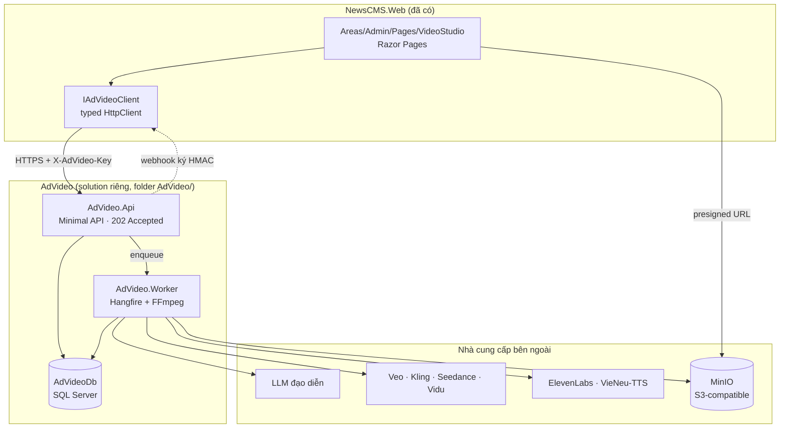
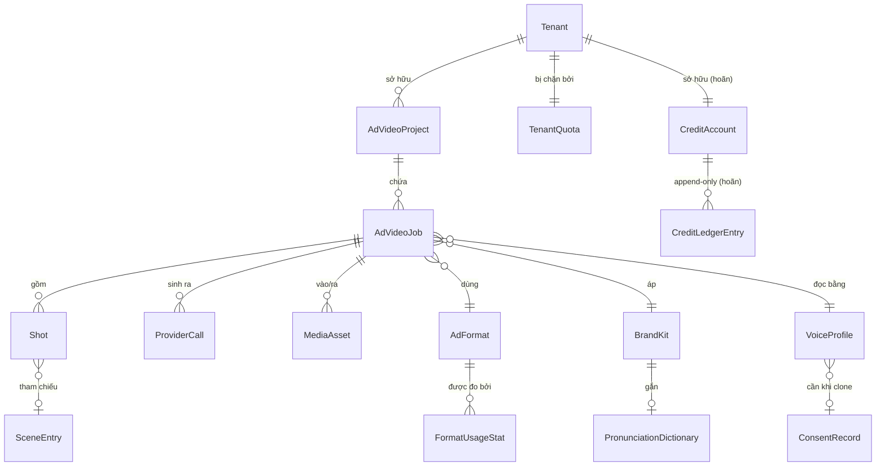
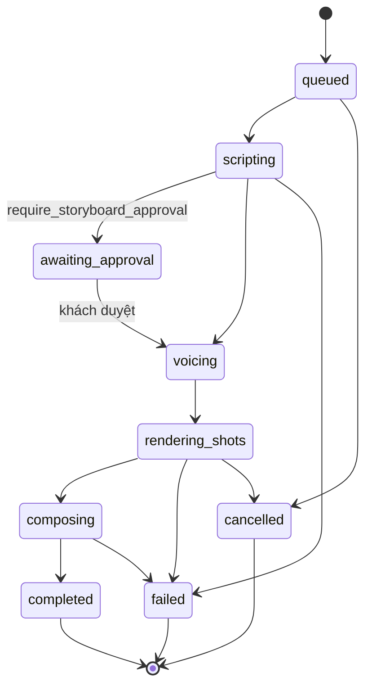

# Xưởng video quảng cáo AI — Thiết kế hệ thống

> Yêu cầu: [../requirements/2026-09-15-feature-ad-video-studio.md](../requirements/2026-09-15-feature-ad-video-studio.md)
> Nguồn gốc: [docs/ke-hoach-service-video-quang-cao.html](../../ke-hoach-service-video-quang-cao.html)

## Architecture Overview

### Ba khối tách bạch



### Trách nhiệm từng khối

| Khối | Làm gì | Tuyệt đối không làm |
|---|---|---|
| **NewsCMS.Web** — module `Marketing/VideoStudio` | Razor Pages nhập brief, chọn ảnh từ Media, duyệt storyboard, xem kết quả. Permission codes + seed. | Không chứa logic dựng video. Không gọi thẳng provider. Không chạm FFmpeg. |
| **AdVideo.Api** | Nhận job, xác thực tenant, validate theo `ProviderCapability`, ước tính chi phí, đẩy vào hàng đợi, trả `202`. | **Không bao giờ chờ video xong.** |
| **AdVideo.Worker** | Chạy pipeline 9 bước. Scale ngang theo số job. FFmpeg cài sẵn trong image. | Không phơi HTTP endpoint cho khách. |
| **MinIO** | Ảnh vào, clip trung gian, thành phẩm, audio mẫu. | Không dùng `wwwroot/uploads`. Không mở bucket public. |
| **AdVideoDb** (SQL Server, DB riêng) | Job state, storyboard, audit từng lần gọi provider kèm chi phí. | Không dùng chung DbContext với NewsCMS. |

### Vì sao service riêng, không phải module trong NewsCMS.Core

Bốn điểm khác về **bản chất**, không phải về mức độ:

1. Mỗi job chạy **3–15 phút**, trong khi web host phục vụ request vài trăm mili-giây.
2. Phụ thuộc **binary ngoài** (FFmpeg) phải có trong image.
3. **Tiêu tiền thật** theo từng request — cần vòng đời và giới hạn riêng.
4. Sẽ phục vụ **nhiều site NewsCMS cùng lúc**.

Nhồi vào web host nghĩa là mỗi lần deploy CMS sẽ giết các job đang render dở. Đúng nguyên tắc "không sửa core" của NewsCMS.

> **Giai đoạn PoC (Sprint 1–2)** có thể chạy `AdVideo.Api` và `AdVideo.Worker` trong cùng một container cho nhanh. Nhưng **tách project ngay từ dòng code đầu tiên** — tách process sau đó chỉ là đổi cấu hình.

### Vì sao .NET (và vì sao không phải Go/Rust)

Đây là hệ điều phối **I/O-bound**. Phân rã thời gian một job 30 giây, tier Chuẩn:

| Giai đoạn | Thời gian | Ai đang làm việc |
|---|---|---|
| Chờ provider render 6 shot | ~4 phút 20 | Máy của Google / Kuaishou |
| FFmpeg ghép, mix, chuẩn hoá | ~40 giây | Tiến trình native |
| Chờ TTS, tải file, upload storage | ~35 giây | Mạng |
| **Code .NET thực thi** | **< 2 giây** | **Chỗ duy nhất ngôn ngữ có ảnh hưởng** |

Lý do chọn .NET, theo thứ tự sức nặng:
1. **NewsCMS đã là .NET** — cùng CI, cùng người maintain, cùng cách debug. Thêm ngôn ngữ thứ hai là thêm một pipeline và một chỗ để hỏng.
2. `async/await` + `Task.WhenAll` đúng công cụ cho fan-out nhiều shot.
3. Hệ sinh thái sẵn: Hangfire (job dài), Polly (retry + circuit breaker), EF Core.

Điểm yếu duy nhất: SDK chính thức của provider thường có bản Python trước. Nhưng cả bốn provider đều là REST thuần — wrapper `HttpClient` là việc của một buổi chiều. **Không tách worker Python chỉ vì SDK.**

### Tech stack

| Thành phần | Chọn | Ghi chú |
|---|---|---|
| Runtime | .NET 8 | Khớp NewsCMS (`global.json`) |
| API | ASP.NET Core Minimal API | Không MVC — service chỉ có JSON endpoint |
| Job queue | Hangfire + SQL Server storage | Không thêm Redis ở giai đoạn đầu |
| ORM | EF Core 8, `IEntityTypeConfiguration<T>` | Convention giống NewsCMS |
| HTTP resilience | Polly (qua `AddStandardResilienceHandler`) | Retry + circuit breaker cho provider hay chết |
| Storage | AWS SDK for .NET, `ForcePathStyle = true` | MinIO là S3-compatible |
| Video/audio | FFmpeg (binary trong image) | Không dùng wrapper .NET nào — gọi process trực tiếp |
| Test | xUnit + FluentAssertions | Khớp `NewsCMS.Tests` |

## Data Models

### Sơ đồ quan hệ



### Bảng entity

Convention: PascalCase số ít, kế thừa `AuditableEntity`, soft-delete qua `ISoftDelete`, cấu hình bằng `IEntityTypeConfiguration<T>` — giống `NewsCMS.Domain.Common.BaseEntity`.

| Entity | Giữ gì | Ghi chú thiết kế | Sprint |
|---|---|---|---|
| `AdVideoProject` | Chiến dịch của khách: tên, sản phẩm, brand kit mặc định | Một project chứa nhiều job — khách thường làm 5–10 biến thể cho cùng sản phẩm | 1 |
| `AdVideoJob` | Brief gốc (JSON), **provider đã chọn**, trạng thái, chi phí ước tính vs thực tế, output URLs | Bảng trung tâm. **Provider nằm ở đây, không phải ở `Shot`** (Luật 1). Index `(TenantId, Status, CreatedAt)` | 1 |
| `Shot` | Thứ tự, thời lượng, prompt hình, lời thoại, seed, `TtsRequestId`, URL clip, số lần render lại | Cho phép regenerate từng shot không đụng job. `TtsRequestId` để shot kế tiếp nối được ngữ điệu | 1 |
| `MediaAsset` | Ảnh vào / clip ra / audio, checksum, kích thước | Trỏ tới object storage, **không** lưu đường dẫn tuyệt đối trên ổ đĩa | 1 |
| `ProviderCall` | Mỗi lần gọi ra ngoài: provider, model, tham số, thời gian, chi phí, thành/bại | **Bắt buộc có từ ngày đầu.** Không có bảng này thì không bao giờ biết vì sao hoá đơn tăng | 1 |
| `ProviderCredential` | Provider, model id, endpoint, **API key mã hoá** (Data Protection), `Scope` (system/tenant), active, ngày hết hạn credit | D10. Khoá mã hoá tại chỗ bằng `ValueConverter` + `IDataProtector` — DB dump không đọc được key. `Scope=tenant` mở đường BYO-key ở Sprint 5 | 1 |
| `SystemSetting` | Key–value có kiểu: `MaxConcurrentShots`, timeout, trần chi tiêu/ngày, tier mapping | Mọi con số **đang phải đoán** (vì Sprint 0 chưa chạy) đều nằm đây — có số liệu thật thì sửa một dòng, không deploy | 1 |
| `PromptTemplate` | Code, version, nội dung, active — negative prompt toàn cục, prompt đạo diễn, prompt theo định dạng | D7 mở rộng: không chỉ `AdFormat`, mọi prompt đều là dữ liệu. Đổi prompt là việc của người biên tập, không phải của dev | 1 |
| `AdFormat` | Shot plan, visual system, vo style, `render_mode`, `requires`, version | **Dữ liệu nạp lúc chạy**, không phải hằng số biên dịch. `TenantId` null = kho chung | 2 |
| `SceneEntry` | Mô tả bối cảnh Việt Nam tái dùng + thẻ phân loại + `verified_on` | Tài sản tích luỹ lâu dài nhất của hệ thống | 3 |
| `VoiceProfile` | Provider + `voice_id` + loại (library/IVC/PVC) + tốc độ + URL nghe thử + `TenantId` | `TenantId` null = giọng chung; có giá trị = giọng riêng, **không được lộ sang tenant khác** | 1 (đọc) / 5 (clone) |
| `BrandKit` | Logo, bảng màu, font, bumper mở/kết, mẫu CTA | Tái sử dụng qua mọi video của cùng khách | 5 |
| `PronunciationDictionary` | Cặp từ → cách đọc, gắn theo BrandKit | Nơi sửa tên thương hiệu bị đọc sai. Đồng bộ lên ElevenLabs, lưu locator | 5 |
| `ProviderCapability` | Lưới thời lượng, số ảnh tham chiếu, tỉ lệ khung hình, chính sách người thật, hệ số giá | **Cấu hình nạp lúc chạy** — provider đổi giới hạn mà mình phải deploy lại là hỏng | 1 |
| `ConsentRecord` | Bằng chứng được phép dùng **hình ảnh và giọng nói** của một người | Một bảng cho cả hai — bản chất rủi ro giống nhau (R5, R6) | 5 |
| `TenantQuota` | Trần credit mỗi job, giới hạn số job song song | Chốt chặn cuối — chặn hành vi bất thường, khác với số dư | 5 |
| `FormatUsageStat` | Format nào, ngành hàng nào, số lần regenerate, khách có tải về không | Nuôi vòng học | 6 |
| `CreditLedgerEntry` `CreditAccount` `CreditPackage` | Sổ tiền của khách | **HOÃN** — làm cùng gói bán. Thiết kế giữ ở mục 09 file HTML làm bản nháp | — |

### Hai cảnh báo về mô hình dữ liệu

> **Đừng dựng phiên bản tạm của tính tiền.** Không thêm cột `credits_remaining` vào bảng tenant, không dùng `TenantQuota` như một cái ví. Một cột số dư tồn tại sáu tháng rồi mới chuyển sang sổ append-only là một cuộc di dời dữ liệu **có tranh chấp tiền bạc đi kèm**.

> **`ProviderCall` phải chạy từ ngày đầu.** Nó không phụ thuộc gì vào credit, nhưng khi ngồi thiết kế gói bán thì dữ liệu chi phí thật của vài trăm video là thứ quyết định hệ số — không có nó thì lại đoán.

## API Design

### `POST /v1/ad-videos` → `202 Accepted`

Bắt buộc chỉ có `brief.prompt` và ít nhất một `assets.product_images`. Mọi trường khác có mặc định hợp lý.

```jsonc
{
  "brief": {
    "product_name": "Sữa hạt Nutri Gold 9 loại hạt",
    "prompt": "Quảng cáo sữa hạt cho gia đình, không khí buổi sáng ấm áp trong bếp...",
    "duration_seconds": 30,        // 6–180; hệ thống tự chia shot
    "aspect_ratio": "9:16",        // mặc định TikTok. Một job = một tỉ lệ
    "format": "daily_soft_sell",   // slug trong kho prompt; null = LLM tự chọn
    "language": "vi"
  },
  "assets": {
    "product_images": ["https://cdn.../hop-truoc.jpg"],
    "talent": {                     // bỏ trống nếu chỉ quay sản phẩm
      "image_url": "https://cdn.../mau-nu.jpg",
      "consent_ref": "CONSENT-2026-0142"   // BẮT BUỘC khi có talent
    },
    "scene_reference": ["https://cdn.../bep-sang.jpg"],
    "brand_kit_id": "bk_nutrigold"
  },
  "voice": {
    "voice_profile_id": "vp_nu_bac_am",   // id nội bộ, KHÔNG phải voice_id ElevenLabs
    "speed": 1.0,
    "script": null                         // null = AI viết lời
  },
  "audio": {
    "native_sound": "sfx_only",   // off (mặc định) | sfx_only | full
    "music": { "mode": "auto", "mood": "uplifting_acoustic" }
  },
  "captions": { "enabled": true, "style": "bold_bottom" },
  "options": {
    "quality": "standard",              // draft | standard | premium
    "provider": null,                   // null = tự chọn theo bảng ánh xạ
    "max_credits": 120,                 // trần cứng, vượt là dừng job
    "require_storyboard_approval": true
  },
  "callback_url": "https://site-khach.vn/api/hooks/ad-video"
}
```

Phản hồi:

```jsonc
{
  "job_id": "vj_01K5R7...",
  "status": "queued",
  "credits_held": 80,
  "credits_balance_after_hold": 220,
  "estimated_ready_at": "2026-09-14T10:22:00Z"
}
```

### Vòng đời job



### Các endpoint còn lại

| Endpoint | Công dụng | Sprint |
|---|---|---|
| `GET /v1/ad-videos/{id}` | Trạng thái + tiến độ từng shot + credit đang giữ/đã chốt | 1 |
| `GET /v1/ad-videos/{id}/storyboard` | Xem storyboard để hiển thị cho khách duyệt | 2 |
| `PATCH /v1/ad-videos/{id}/storyboard` | Sửa lời thoại / mô tả hình một shot rồi duyệt | 2 |
| `POST /v1/ad-videos/{id}/shots/{n}/regenerate` | **Quan trọng nhất về chi phí.** Render lại đúng 5 giây đó, không phải cả video | 2 |
| `POST /v1/ad-videos/{id}/reframe` | Xuất tỉ lệ khác — **tái dùng storyboard và voice-over**, chỉ render lại hình | 5 |
| `GET /v1/ad-videos/{id}/assets` | Presigned URL 15 phút: MP4, thumbnail, .srt, voice-over rời | 1 |
| `POST /v1/ad-videos/{id}/cancel` | Huỷ job đang chạy, dừng phát sinh chi phí | 1 |
| `POST /v1/estimates` | **Số credit chính xác** + thời gian chờ, không tạo job. Công thức tất định | 2 |
| `GET /v1/providers` | Provider đang sống + `ProviderCapability` — để UI tự dựng form | 1 |
| `GET /v1/formats` | Danh mục định dạng + video ví dụ + `requires` + thời gian chờ dự kiến | 2 |
| `GET /v1/voices` | Kho giọng tuyển chọn + giọng riêng tenant + URL nghe thử | 1 |
| `POST /v1/voices/clone` | Tạo giọng riêng từ ghi âm. Bắt buộc kèm xác nhận quyền | 5 |
| `GET /v1/credits`, `GET /v1/credits/ledger` | Số dư và sổ giao dịch | **Hoãn** |

### Webhook

Sự kiện: `job.storyboard_ready` · `job.shot_completed` · `job.completed` · `job.failed`.
Gửi lại theo cấp số nhân trong 24 giờ; mọi payload kèm `job_id` để bên nhận tự đối chiếu.

### Xác thực và multi-tenant

- Mỗi site NewsCMS = một tenant, có API key riêng (`X-AdVideo-Key`) và hạn mức riêng.
- Webhook ký bằng **HMAC-SHA256** với secret của tenant, header `X-AdVideo-Signature` + timestamp chống replay.
- Mọi request tạo job **bắt buộc có `Idempotency-Key`** — bấm nút hai lần không được tính tiền hai lần.
- Quyền trong NewsCMS theo convention `Module.Subject.Action` trong `NewsCMS.Shared/Constants/Permissions.cs`:
  `Marketing.AdVideo.View` · `.Create` · `.Approve` · `.Delete`, seed qua `DbSeeder`.

## Component Breakdown

### Cấu trúc thư mục

```
AdVideo/
  AdVideo.sln
  src/
    AdVideo.Api/                  Minimal API, endpoint groups, auth middleware
    AdVideo.Worker/               Hangfire host, pipeline steps, FFmpeg
    AdVideo.Core/                 Entity, interface, record — không phụ thuộc hạ tầng
      Abstractions/               IVideoProvider, ITtsProvider, IStorage, ILlmDirector
      Entities/                   AdVideoJob, Shot, ProviderCall, ...
      Pipeline/                   IPipelineStep + contract từng bước
    AdVideo.Infrastructure/       EF Core, adapter provider, MinIO, FFmpeg wrapper
      Persistence/                AdVideoDbContext + Configurations/
      Providers/Video/            VeoProvider, KlingProvider, SeedanceProvider, ViduProvider
      Providers/Tts/              ElevenLabsTtsProvider, VieNeuTtsProvider
      Storage/                    MinioStorage
      Ffmpeg/                     FfmpegComposer, FfmpegProbe
  tests/
    AdVideo.Tests/                xUnit + FluentAssertions
```

Phía NewsCMS (sửa tối thiểu, đúng nguyên tắc "không sửa core"):

```
NewsCMS.Core/src/
  NewsCMS.Application/VideoStudio/IAdVideoClient.cs        (mới)
  NewsCMS.Infrastructure/VideoStudio/AdVideoClient.cs      (mới, typed HttpClient)
  NewsCMS.Web/Areas/Admin/Pages/VideoStudio/               (mới)
  NewsCMS.Shared/Constants/Permissions.cs                  (sửa: thêm class Marketing)
  NewsCMS.Infrastructure/Persistence/Seed/DbSeeder.cs      (sửa: seed permission mới)
```

### Pipeline 9 bước

Bước có dấu **§** là bước gọi ra API bên ngoài và **phát sinh chi phí**.

| # | Bước | Làm gì | Thời gian |
|---|---|---|---|
| 1 | **Ingest & chuẩn hoá asset** | Tải ảnh, kiểm định dạng, resize về khung hình đích, tách nền nếu cần, moderation. *Từ chối sớm còn hơn hỏng ở bước 6.* | ~10s |
| 2 | **§ Đạo diễn: brief → storyboard** | LLM **không viết tự do** — nhận một `AdFormat` rồi điền vào: mô tả hình, chuyển động camera, ảnh tham chiếu, lời thoại, chữ overlay, chuyển cảnh | ~15s |
| 3 | **Duyệt storyboard** *(tuỳ chọn)* | Job dừng ở `awaiting_approval`. Bật mặc định cho video > 20 giây | chờ người |
| 4 | **§ Sinh giọng đọc tiếng Việt** | Gọi `/with-timestamps` → **mốc thời gian tới từng ký tự**. Nối ngữ điệu bằng `previous_text` / `previous_request_ids` | ~20s |
| 5 | **Khoá timeline** | Gán thời lượng shot theo độ dài audio thật, làm tròn lên **lưới của provider đang chọn**. Phần dư bù bằng hold-frame hoặc Ken Burns, **không kéo giãn video** | ~1s |
| 6 | **§ Render shot** | Song song hay tuần tự do `render_mode` của format quyết định. Retry **cùng provider**, đổi seed | 2–10 phút |
| 7 | **§ Lip-sync** *(chỉ khi có người nói)* | Bỏ qua hoàn toàn với video chỉ có sản phẩm | ~1 phút |
| 8 | **Compose bằng FFmpeg** | Nối shot + chuyển cảnh, trộn VO với nhạc (ducking −12 dB), tiếng động gốc nếu bật (−18 dB, crossfade 250 ms tại mỗi chỗ cắt), logo, CTA, phụ đề burn-in, **nhãn AI + metadata**, chuẩn hoá −14 LUFS | ~40s |
| 9 | **QC tự động & giao hàng** | Đúng thời lượng, không khung đen, audio không clip, không lệch tiếng, không NSFW, **nhãn AI có mặt**, VAD trên track tiếng động. Đẩy MinIO, sinh thumbnail + .srt, bắn webhook | ~20s |

> **Thứ tự 4 → 5 → 6 là không thể đảo.** Render trước rồi mới sinh giọng thì phải hoặc cắt câu thoại cho vừa hình, hoặc tăng tốc độ đọc lên 1,2× — cả hai đều nghe ra ngay là video máy làm.

### Interface tối thiểu

```csharp
// Điểm mấu chốt: BẮT BUỘC trả về timing, không chỉ tổng thời lượng.
public interface ITtsProvider
{
    Task<TtsResult> SynthesizeAsync(TtsRequest req, CancellationToken ct);
}

public record TtsRequest(
    string   Text,
    VoiceSpec Voice,
    string?  PreviousText,          // lời shot trước — giữ ngữ điệu liền mạch
    string?  NextText,
    string[]? PreviousRequestIds,   // tối đa 3
    string?  PronunciationDictId,   // theo BrandKit
    int?     Seed);

public record TtsResult(
    Stream   Audio,
    TimeSpan Duration,
    CharTiming[] Timings,           // → khoá timeline + sinh .srt
    string   RequestId,             // → truyền vào shot kế tiếp
    decimal  CostUsd);
```

```csharp
public interface IVideoProvider
{
    string Key { get; }                                  // "veo" | "kling" | "seedance" | "vidu"
    ProviderCapability Capability { get; }               // nạp lúc chạy, không hard-code
    Task<ShotRenderResult> RenderAsync(ShotRenderRequest req, CancellationToken ct);
    Task<ProviderHealth> ProbeAsync(CancellationToken ct); // cho smoke test hằng ngày
}
```

### Bảng so sánh provider (giai đoạn đầu)

| Model | Giá/giây | Ảnh tham chiếu | Người thật | Độ dài | Vai trò |
|---|---|---|---|---|---|
| **Veo 3.1 Fast** (Google) | $0,08–0,12 | 3 ảnh | ❌ chặn mặt | 4/6/8s | **Lựa chọn 1** — mặc định cho video chỉ có sản phẩm |
| **Kling 3.0** (Kuaishou) | $0,084–0,17 | image + elements | ✅ | 3–15s | **Lựa chọn 2** — mặc định khi có người mẫu |
| **Seedance 2.0** (ByteDance) | $0,14–0,30 | multimodal ref | ✅ | 4–15s | **Lựa chọn 3** — tier cao cấp, đắt 2–3× |
| **Vidu Q2 Pro** | $0,085 | **1–7 ảnh, đa chủ thể** | ✅ | 1–10s | **Lựa chọn 4** — nhiều chủ thể trong một khung |
| Veo 3.1 Lite | $0,03–0,08 | ❌ | ❌ | 4–8s | B-roll, bản nháp preview |
| Runway Gen-4.5 | $0,05–0,12 | ✅ | ✅ | ≤10s | Dự phòng, không code trong 9 tuần đầu |
| ~~Sora 2 / Pro~~ | — | — | — | — | **Gỡ khỏi API 24/09/2026. Không viết adapter.** |

> Giá tổng hợp từ trang so sánh công khai 7–9/2026, **phải xác minh lại trên bảng giá chính thức trước khi ký hợp đồng**. Cột "Người thật" phản ánh chính sách nội dung, không phải khả năng kỹ thuật.

### Manifest `ProviderCapability`

| Khả năng | Veo 3.1 Fast | Kling 3.0 | Seedance 2.0 | Vidu Q2 Pro |
|---|---|---|---|---|
| Thời lượng shot | 4/6/8s (rời rạc) | 3–15s (bước 1s) | 4–15s | 1–10s (mặc định 5) |
| Ảnh tham chiếu | tối đa 3 | image + elements | multimodal ref | **1–7, chia theo chủ thể** |
| Khung hình | 16:9 · 9:16 | 16:9 · 9:16 · 1:1 | 7 tỉ lệ | 16:9 · 9:16 · 1:1 |
| Ảnh có mặt người | ❌ từ chối | ✅ | ✅ | ✅ |
| Điều khiển audio gốc | bật/tắt cả cụm | bật/tắt cả cụm | bật/tắt cả cụm | **tách được thoại/tiếng động** |
| Nối frame cho daily | ✅ cùng endpoint | ✅ cùng endpoint | ✅ cùng endpoint | ⚠️ endpoint khác |
| Giá tương đối | 1× | ~1× | 2–3× | ~1× |

### Bảng ánh xạ tier → provider

Nằm trong **cấu hình**, không hard-code — đổi provider mặc định không được là một lần deploy.

| Tier khách chọn | Chỉ có sản phẩm | Có người mẫu | Giá vốn 30s |
|---|---|---|---|
| Nháp | Veo 3.1 Lite · 720p | Kling 3.0 · 720p | ~$1,1 |
| **Chuẩn** | Veo 3.1 Fast · 1080p | Kling 3.0 · 1080p | ~$3,2 |
| Cao cấp | Seedance 2.0 | Seedance 2.0 | ~$11,0 |
| **Chuẩn · đa chủ thể**<br>(brief có ≥2 chủ thể phải giữ nhất quán) | Vidu Q2 Pro · reference-to-video — **quy tắc này thắng lựa chọn theo tier** | | ~$2,6 |

### Cách vào provider: đi thẳng hay qua aggregator

Dùng **cả hai**, và đó chính là lý do `IVideoProvider` tồn tại:

- **fal.ai** làm cửa chính cho Kling, Seedance, Vidu — một API key, một kiểu queue + webhook, chỉ tính tiền khi job thành công. Đổi model chỉ là đổi chuỗi endpoint. Đánh đổi: có markup.
- **Gemini API** gọi thẳng cho Veo, vì đây sẽ là model chạy nhiều nhất. *Lưu ý vận hành: video chỉ lưu trên server Google 2 ngày — worker phải tải về ngay khi job xong.*

## Design Decisions

Mười quyết định định hình toàn bộ phần còn lại.

| # | Quyết định | Lý do | Cái giá phải trả |
|---|---|---|---|
| **D1** | **Service riêng**, không nhét vào NewsCMS.Web | Job 3–15 phút, ngốn FFmpeg/CPU, tiêu tiền thật, phục vụ nhiều site | Thêm một process phải deploy và theo dõi |
| **D2** | **Provider là thứ có thể thay**, không phải nền móng | Sora bị khai tử sau 6 tháng là bằng chứng thực tế, không phải giả định | Bốn adapter phải chạy được thật, không để ba cái nằm im làm cảnh |
| **D3** | Tắt **thoại** của model, không nhất thiết tắt **tiếng động** | Thoại AI tiếng Việt sai dấu; tiếng động đồng bộ theo chuyển động thì model làm rất tốt | Phải kiểm VAD để chắc model không lén chèn tiếng người |
| **D4** | Mọi chữ trên màn hình **do FFmpeg vẽ** | Không model nào viết đúng "Sữa hạt không đường — Ưu đãi đến 30/9" | Overlay phải tự dựng; cần font tiếng Việt thật |
| **D5** | Video dài = **nhiều shot ghép lại** | Không model nào sinh quá 15 giây một lần gọi | Cần lớp "đạo diễn" LLM — đây là phần lõi, không phải phần phụ |
| **D6** | Sinh giọng đọc **trước**, rồi mới khoá thời lượng shot | Câu 4,8 giây phải quyết định shot dài bao nhiêu, không phải ngược lại | Không render được gì trước khi TTS xong |
| **D7** | Kho prompt là **dữ liệu**, không phải code | Thêm định dạng, sửa mô tả, nhân bản cho một khách — không cái nào được cần một lần deploy | Cần UI/CLI quản lý dữ liệu này |
| **D8** | **Hai sổ tiền**, không phải một | Credit neo vào giây video (không nhúc nhích khi provider đổi giá); đô la thật trong `ProviderCall` | Phải đối soát hai sổ |
| **D9** | Nhãn AI là **một bước trong pipeline**, không phải một tuỳ chọn | Luật TTNT 2025 buộc **bên triển khai** gắn nhãn — không chuyển sang khách được | Khách không tắt được, kể cả khi họ muốn |
| **D10** | Key provider, cấu hình vận hành và prompt nằm **trong DB** (mã hoá), không hard-code trong config file | Provider đổi model id / đổi giá / đổi giới hạn là chuyện hằng tuần — sửa một dòng DB không cần deploy. Mở đường cho khách tự mang key riêng (BYO) ở Sprint 5. Cũng là cách giảm rủi ro khi Sprint 1 chạy trước Sprint 0: mọi con số đang đoán đều sửa được về sau mà không đụng code | Env chỉ còn đúng hai thứ (connection string + master key mã hoá); phải tự dựng lớp mã hoá và cache, và một lần rò DB là rò cả key — nên mã hoá tại chỗ bằng Data Protection là **bắt buộc**, không tuỳ chọn |

### Ba luật khi cho khách chọn provider

**Luật 1 — Provider là thuộc tính của *job*, không phải của *shot*.**
Mỗi model có "look" riêng: tông màu, độ tương phản, cách xử lý chuyển động, kết cấu da. Ghép một shot Veo với một shot Seedance là nhìn ra ngay hai đoạn dán lại.
- Một job dùng **một provider cho toàn bộ shot**.
- Shot lỗi → retry **cùng provider**, đổi seed. Không đổi model.
- Provider chết hẳn → **fail cả job**, mời khách render lại, chứ không âm thầm vá một shot bằng model khác.

**Luật 2 — Tầng API phải chuẩn hoá, không được pass-through.**
Ba hệ quả cho code:
- Bước khoá timeline làm tròn theo **lưới thời lượng của provider đang chọn** → storyboard phải sinh *sau* khi biết provider.
- Khách chọn Veo nhưng có `talent` → trả `422` kèm lý do đọc được + gợi ý Kling.
- `audio.native_sound` phải dịch sang từng provider. **Chỉ Vidu dịch được trọn vẹn** (ba chế độ audio riêng). Ba provider kia chỉ bật/tắt cả cụm → khi khách chọn `sfx_only` phải bật audio + thêm `"no speech, no dialogue, no voices"` vào negative prompt + kiểm VAD ở bước 9. **Mặc định mọi provider vẫn là tắt (D3) — Vidu bật sẵn nên đây là chỗ dễ quên nhất.**

**Luật 3 — Đừng bắt người làm marketing biết Veo là gì.**
Phơi ra hai tầng: UI trong NewsCMS cho khách chọn *tier* + trả lời "video có người xuất hiện không?", rồi hiện tên model thật và giá ước tính trước khi bấm. API có trường `provider` tường minh cho dev.

### Alternatives đã cân nhắc và loại

| Phương án | Vì sao loại |
|---|---|
| Module thuần trong NewsCMS.Core | Deploy CMS sẽ giết job đang render dở; không scale nhiều instance được |
| Viết worker bằng Go/Rust | Code .NET chạy < 2 giây trong job 5 phút — tối ưu sai chỗ. Thêm ngôn ngữ = thêm pipeline để hỏng |
| Worker Python riêng chỉ vì SDK provider tốt hơn | Cả bốn provider đều REST thuần; wrapper `HttpClient` là việc một buổi chiều |
| Fallback shot sang provider khác khi lỗi | **Sai** — tiết kiệm một lần render, trả giá bằng video có vết nối nhìn thấy rõ (Luật 1) |
| Dùng thoại do model video sinh | Sai dấu, sai trọng âm, không dùng được cho quảng cáo (D3) |
| Để AI vẽ chữ lên khung hình | Không model nào viết đúng tiếng Việt có dấu (D4) |
| `wwwroot/uploads` làm storage | Video 1080p/60s nặng 30–60 MB; vài nghìn video là vỡ ổ đĩa web host |
| Vbee / FPT.AI làm adapter TTS thứ hai | Thay bằng VieNeu-TTS: cả ba đều là giọng Việt bản địa, nhưng chỉ VieNeu tự host và clone giọng không giới hạn |
| Xây kho giọng mẫu trên ElevenLabs Default voices | **Hết hạn 31/12/2026** — sang năm toàn bộ `voice_id` chết. Dùng Voice Library thay thế |

## Non-Functional Requirements

### Hiệu năng & scale

- **Thứ thật sự giới hạn throughput là rate limit của provider**, không phải CPU: mỗi tài khoản được chạy bao nhiêu request song song, bao nhiêu phút render mỗi giờ. Con số này quyết định kiến trúc scale nhiều hơn mọi lựa chọn ngôn ngữ — **phải đo trong Sprint 0**.
- Ba thứ quyết định "nhanh": số job chạy song song được, mức fan-out shot trong một job, và không có chỗ nào chờ đồng bộ. Cả ba đều là chuyện thiết kế.
- Worker scale ngang theo số job. **VieNeu-TTS chạy trên worker tách khỏi FFmpeg** — hai thứ cùng ăn CPU thì tranh nhau.

### Storage — bốn thứ phải chốt khi cấu hình MinIO

1. **Tách bucket theo vòng đời, không theo khách.** `adv-uploads` · `adv-work` · `adv-final` · `adv-voice`. Đường dẫn trong bucket mới chia theo tenant: `{tenantId}/{jobId}/shot-03.mp4`.
2. **Lifecycle rule ngay từ đầu, đừng để sau.** `adv-work` xoá sau **7 ngày** (bucket phình nhanh nhất — mỗi job đẻ 5–10 file trung gian). `adv-final` chuyển lớp lạnh sau **90 ngày**.
3. **Presigned URL cho mọi thứ khách tải về**, hạn 15 phút, không mở bucket public. Hai chỗ hay làm hỏng: *CORS* phải khai đúng origin của NewsCMS (thiếu là trình duyệt chặn mà không có lỗi rõ ràng), và *lệch giờ máy chủ* làm chữ ký hết hạn sớm — **bật NTP trên máy MinIO**.
4. **Video giao cho khách đi qua CDN hoặc reverse proxy** — đừng để trình duyệt gọi thẳng MinIO (vừa lộ hạ tầng vừa không cache được).

### Bảo mật

- API key riêng theo tenant (`X-AdVideo-Key`), hash lưu trong DB.
- Webhook ký HMAC-SHA256 + timestamp chống replay.
- `Idempotency-Key` bắt buộc trên mọi request tạo job.
- Giọng riêng của tenant **không bao giờ hiện trong danh sách của tenant khác** — filter theo `TenantId` ở tầng repository, không phải ở tầng UI.
- Secrets provider (API key) lưu **trong DB, mã hoá tại chỗ** bằng ASP.NET Core Data Protection (D10) — không nằm trong `appsettings.json`, không commit. Hai thứ **bắt buộc** ở lại environment vì không thể bootstrap từ chính DB: connection string của `AdVideoDb` và master key của Data Protection. Log không bao giờ in key, kể cả đã giải mã; endpoint đọc `ProviderCredential` chỉ trả về 4 ký tự cuối.
- Bộ lọc cụm từ cấm chạy trên lời thoại **trước** khi gọi TTS.

### Độ tin cậy

- Polly retry + circuit breaker cho mọi provider.
- **Smoke test hằng ngày cho từng provider** — phát hiện API đổi trước khi khách phát hiện.
- Job idempotent theo bước: retry một bước không được làm hỏng bước trước.
- Cảnh báo khi chi tiêu đô la trong ngày vượt ngưỡng.
- Giới hạn số shot đồng thời mỗi tenant.

### Chi phí (mục tiêu vận hành)

| Thành phẩm | Số shot | Lý thuyết | Thực tế (×2,0) | Giá vốn/video |
|---|---|---|---|---|
| 15 giây · 9:16 | 3 | $1,65 | $3,30 | ~87.000 đ |
| **30 giây · 9:16** | 6 | $3,15 | $6,30 | **~166.000 đ** |
| 60 giây · 16:9 | 10 | $6,20 | $12,40 | ~327.000 đ |
| 40 giây · daily (nối frame, ×2,8) | 5 | $4,45 | $12,50 | ~330.000 đ |
| 30 giây · tier premium | 6 | $11,00 | $22,00 | ~580.000 đ |

Ba đòn bẩy giảm giá vốn, theo thứ tự hiệu quả:
1. **Regenerate từng shot thay vì cả video** — đây là lý do endpoint đó tồn tại; nó cắt phần lớn hệ số 2,0×.
2. **Duyệt storyboard trước khi render** — sửa một dòng chữ tốn $0; sửa sau khi render tốn cả job.
3. **Tier draft dùng Veo Lite 720p** — cho khách xem nháp với giá bằng 1/3.

> Định dạng daily nên là **một mức giá riêng, cao hơn**. Nó tốn gấp bốn lần video 30 giây thường và khách phải chờ 8–15 phút — bán cùng giá là vừa lỗ vừa tạo kỳ vọng sai về thời gian chờ.
