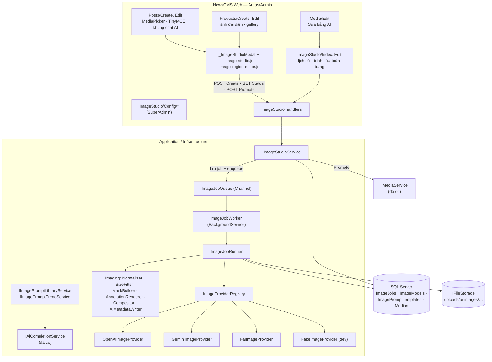
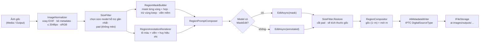
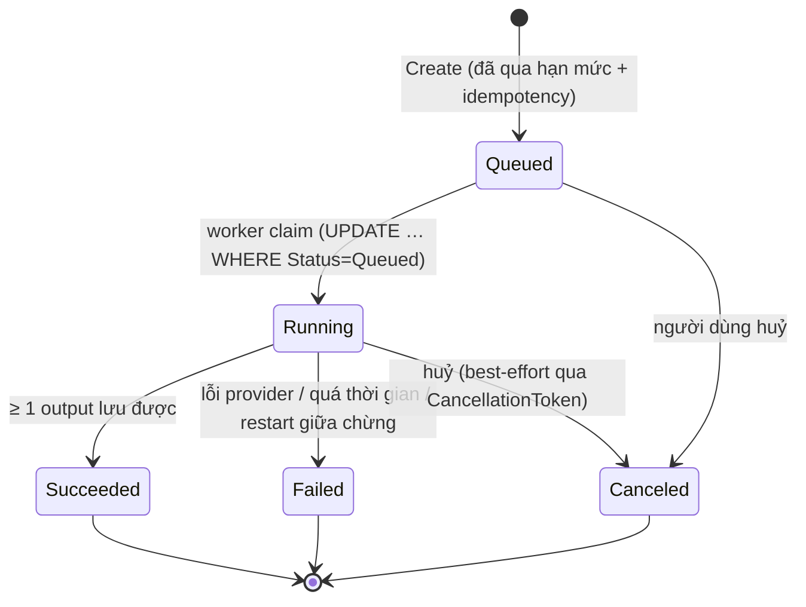

# Xưởng ảnh AI (ImageStudio) — Thiết kế

> Yêu cầu: [../requirements/2026-09-29-feature-ai-image-studio.md](../requirements/2026-09-29-feature-ai-image-studio.md)
> Kế hoạch: [../planning/2026-09-29-feature-ai-image-studio.md](../planning/2026-09-29-feature-ai-image-studio.md)

## 1. Tổng quan



Module mới tên **ImageStudio**, đặt song song VideoStudio:

```
NewsCMS.Domain/Entities/ImageStudio/
NewsCMS.Application/ImageStudio/
NewsCMS.Infrastructure/ImageStudio/{Providers,Imaging,Jobs}/
NewsCMS.Web/Areas/Admin/Pages/ImageStudio/  (+ Config/)
```

## 2. Quyết định thiết kế

| # | Quyết định | Vì sao |
|---|---|---|
| **D1** | **Làm trong NewsCMS, không đưa sang AdVideo.** | Ảnh là việc ngắn (5–120 giây), kết quả phải vào `Medias` theo site. Kết nối AI, skill, tool tìm web, kho prompt, `IFileStorage` và `ImageSharp` đều đã có ở NewsCMS. AdVideo sinh ra cho pipeline video nặng (Hangfire, FFmpeg, MinIO, vòng đời `adv-work`). Đưa ảnh sang đó là thêm một chặng mạng, thêm một bộ key tenant, trong khi chẳng dùng tới thứ nào trong số đó. Chỉ **mượn ý tưởng** từ AdVideo: allowlist host (SSRF), sổ `ProviderCall`, D10 "con số chưa kiểm chứng nằm trong DB". |
| **D2** | **Model tạo ảnh là dữ liệu** (bảng `ImageModels`), SuperAdmin cấu hình sẵn; **người dùng chọn một trong các model đó** như chọn giọng đọc ở VideoStudio. Key dùng lại `AiConnection`. | Đổi provider không cần deploy (theo D10 của AdVideo). Key đã được mã hoá bằng DataProtection trong `AiConnection`, không cần kho key thứ hai; 9Router dùng một key cho cả chat lẫn ảnh. Không cần thêm cờ phạm vi: mọi chỗ chat đều chỉ dùng kết nối **mặc định**, nên kết nối chỉ dành cho ảnh (fal, Gemini) không ảnh hưởng chat, miễn là không đặt nó làm mặc định. |
| **D3** | **Kết quả chưa vào thư viện media.** Ảnh sinh ra nằm ở `ImageJobOutputs` (storage `ai-images/outputs/…`). Chỉ khi người dùng bấm **"Dùng ảnh này"** mới *promote* thành `Media`. Output không được chọn sẽ bị dọn sau N ngày. | Mỗi lần tạo ra 2–4 biến thể; đưa hết vào thư viện thì thư viện ngập rác. Cách này còn gỡ luôn vấn đề site-scope: promote chạy trong HTTP request nên có `CurrentSiteId`, còn worker chỉ ghi file, không tạo `Media`. |
| **D4** | **Job lưu bền trong DB và xếp hàng bằng `Channel`**, không dùng Hangfire. | NewsCMS không có Hangfire. `VideoCompressionQueue` cố ý không lưu bền vì mất job chỉ làm video to hơn. Ảnh AI thì khác: mất job là mất tiền đã trả. Nên job nằm trong DB; khi khởi động, worker quét lại job `Queued` và đánh lỗi job `Running` đã quá hạn. |
| **D5** | **Sửa theo vùng = mask + chỉ dẫn đánh số + ghép lại điểm ảnh gốc.** | Model (nhất là loại sửa bằng lời) hay vẽ lại cả ảnh, làm lệch mặt người, chữ và màu ở chỗ không được bảo sửa. **Không tin model giữ nguyên phần ngoài vùng.** Sau khi nhận kết quả, server ghép lại: `out = gốc·(1−m) + mới·m` với `m` là mask có viền mềm. Nhờ vậy tiêu chí "100% điểm ảnh ngoài vùng giữ nguyên" kiểm được bằng test. |
| **D6** | **Hai chiến lược sửa, chọn tự động theo năng lực model.** Model nhận mask thì gửi mask. Model chỉ sửa bằng lời thì gửi ảnh gốc, ảnh đánh dấu (có số #1, #2 trên từng vùng) và chỉ dẫn. | Không nhà cung cấp nào có cả hai. D5 bảo đảm kết quả cuối giống nhau về phần giữ nguyên, chỉ khác độ chính xác bên trong vùng. |
| **D7** | **Không bao giờ ghi đè `Media` gốc.** Sửa ảnh luôn tạo `Media` mới (`Origin = ai-edited`, `AiJobId`). | Bài cũ đang trỏ vào URL cũ. Ghi đè sẽ âm thầm đổi ảnh trong bài đã xuất bản. |
| **D8** | **Kho mẫu ảnh là bảng riêng** (`ImagePromptTemplates`), không gộp chung với `VideoPromptTemplates`. **Dùng chung luật nội dung và bộ lập lịch trend.** | Trường khác nhau (mục đích, ảnh nguồn, chế độ vùng; video thì có lời thoại, thời lượng). Kho video vừa chạy xong và đã có test, không nên đụng tới cấu trúc của nó. Phần lặp lại được tách ra làm code dùng chung (xem mục 7). |
| **D9** | **"Bài hoàn chỉnh có ảnh" được điều phối ở client**, trong khung chat AI đang có. Ô ảnh chờ viết là `<figure class="ai-image-slot" id="ai-slot-N">`. Server gỡ ô chờ chưa có ảnh khi lưu bài. | Giữ người duyệt ở giữa vòng lặp: không tự đăng, và người dùng sửa được prompt từng ảnh. `class` và `id` đã qua được `ContentSanitizer`, không cần nới whitelist. |
| **D10** | **Không tự thử lại sau khi provider đã nhận request tính tiền.** Chỉ thử lại **một lần** khi gặp 429/5xx/timeout kết nối *trước khi có output*. Lỗi 4xx (vi phạm nội dung, sai tham số) thì dừng luôn. | Bài học R2 của AdVideo: vòng retry sai là thủng ví. |
| **D11** | **Nhãn AI bắt buộc ở tầng dữ liệu.** Mọi output đều được ghi metadata IPTC `DigitalSourceType` và `Media.Origin`. Chú thích hiển thị ("Ảnh minh hoạ tạo bởi AI") là setting theo site, mặc định bật. | Nghĩa vụ gắn nhãn đã ghi ở R4 của AdVideo (Luật TTNT 2025). Hình thức nhãn hiển thị chờ pháp chế chốt (Q3), nhưng metadata thì làm ngay vì không ảnh hưởng hiển thị. |

## 3. Mô hình dữ liệu

### 3.1 Cấu hình model (toàn hệ thống, SuperAdmin)

```csharp
// NewsCMS.Domain/Entities/ImageStudio/ImageModel.cs
public class ImageModel : AuditableEntity, ISoftDelete
{
    public string Name { get; set; }                 // "GPT Image (9Router)", "Nano Banana", "FLUX Fill"
    public string? Description { get; set; }         // hiện cho người dùng khi chọn model
    public Guid ConnectionId { get; set; }           // → AiConnection (BaseUrl + key mã hoá)
    public ImageProviderAdapter Adapter { get; set; }// OpenAiImages | Gemini | FalQueue | Fake
    public string ModelId { get; set; }              // "gpt-image-1", "cx/gpt-5.5-image", "fal-ai/flux-pro/v1/fill"… (admin nhập)
    public ImageCapabilities Capabilities { get; set; } // [Flags] TextToImage | ReferenceImages | MaskEdit | InstructionEdit
    public int MaxReferenceImages { get; set; }      // 0 = không nhận ảnh tham chiếu
    public MaskConvention MaskConvention { get; set; } // AlphaZeroIsEdit (OpenAI) | WhiteIsEdit (fal) | None
    public string SupportedSizesJson { get; set; }   // ["1024x1024","1536x1024","1024x1536"] hoặc ["1:1","16:9","9:16","4:3","3:4"]
    public int MaxVariants { get; set; } = 4;
    public string? DefaultQuality { get; set; }      // "auto" | "low" | "medium" | "high"
    public string OutputFormat { get; set; } = "png";
    public decimal PricePerImageUsd { get; set; }    // ước tính để hiện trước khi tạo; chi phí thật ghi ở ImageProviderCall
    public decimal? PricePerEditUsd { get; set; }
    public int TimeoutSeconds { get; set; } = 180;
    public string? ExtraParamsJson { get; set; }     // tham số riêng của provider, trộn vào body (chỉ các key trong allowlist của adapter)
    public bool IsActive { get; set; }
    public bool IsDefault { get; set; }
    public int SortOrder { get; set; }
    public DateTime? LastTestedAt { get; set; }
    public bool? LastTestOk { get; set; }
    public string? LastTestError { get; set; }
    // ISoftDelete…
}
```

`ImageModel` còn có `Description` (một câu cho người dùng: "Nhanh, rẻ — hợp ảnh minh hoạ"). Form tạo ảnh
hiện danh sách model đang bật dạng thẻ chọn một (tên, mô tả, giá ước tính mỗi ảnh), model mặc định chọn sẵn.

### 3.2 Job, output, sổ gọi provider (theo site)

```csharp
public class ImageJob : AuditableEntity, ISiteScoped
{
    public Guid SiteId { get; set; }
    public ImageJobMode Mode { get; set; }           // Generate | Reference | RegionEdit
    public ImagePurpose Purpose { get; set; }        // Free | PostCover | PostInline | ProductMain | ProductGallery | Banner | Social
    public Guid ImageModelId { get; set; }
    public Guid? TemplateId { get; set; }
    public string UserPrompt { get; set; }           // người dùng gõ / mẫu sau khi điền chỗ giữ
    public string FinalPrompt { get; set; }          // prompt thật gửi đi (kèm phong cách site, chỉ dẫn vùng) — để truy vết, tạo lại
    public string? NegativePrompt { get; set; }
    public string Size { get; set; }                 // "1536x1024" hoặc "16:9"
    public string? Quality { get; set; }
    public int VariantCount { get; set; }
    public Guid? SourceMediaId { get; set; }         // ảnh gốc cần sửa / ảnh tham chiếu chính
    public Guid? SourceOutputId { get; set; }        // "Sửa tiếp" từ output chưa promote
    public string? ReferenceMediaIdsJson { get; set; }
    public string? RegionsJson { get; set; }         // ImageEditRequest.Regions (mục 5.1)
    public RegionStrategy Strategy { get; set; }     // Single | Sequential
    public bool PreserveOutside { get; set; } = true;
    public string? MaskStorageKey { get; set; }
    public string? AnnotatedStorageKey { get; set; }
    public Guid? ParentJobId { get; set; }           // chuỗi phiên bản
    public string? ContextType { get; set; }         // "post" | "product" | "media"
    public Guid? ContextId { get; set; }
    public ImageJobStatus Status { get; set; }       // Queued | Running | Succeeded | Failed | Canceled
    public string? Error { get; set; }               // tiếng Việt, đã che key
    public DateTime QueuedAt { get; set; }
    public DateTime? StartedAt { get; set; }
    public DateTime? FinishedAt { get; set; }
    public decimal EstimatedCostUsd { get; set; }
    public decimal CostUsd { get; set; }
    public string IdempotencyKey { get; set; }       // unique (SiteId, IdempotencyKey)
    public bool RightsConfirmed { get; set; }        // tick "tôi có quyền dùng ảnh này" khi tải ảnh lên để sửa
    public ICollection<ImageJobOutput> Outputs { get; set; }
}

public class ImageJobOutput : BaseEntity
{
    public Guid JobId { get; set; }
    public int Index { get; set; }
    public string StorageKey { get; set; }
    public string Url { get; set; }
    public int Width { get; set; }
    public int Height { get; set; }
    public long Bytes { get; set; }
    public string MimeType { get; set; }
    public Guid? PromotedMediaId { get; set; }       // != null → đã vào thư viện, không bị dọn
    public DateTime? PromotedAt { get; set; }
}

public class ImageProviderCall : BaseEntity           // nguồn sự thật về chi phí (như ProviderCall của AdVideo)
{
    public Guid JobId { get; set; }
    public Guid SiteId { get; set; }
    public Guid ImageModelId { get; set; }
    public string ModelId { get; set; }
    public string Operation { get; set; }            // generate | edit
    public int? HttpStatus { get; set; }
    public int DurationMs { get; set; }
    public int ImagesReturned { get; set; }
    public decimal CostUsd { get; set; }
    public string? ErrorCode { get; set; }           // content_policy | rate_limited | timeout | bad_request | provider_error
    public string? ErrorMessage { get; set; }        // đã che key và base64, cắt 500 ký tự
}
```

Index: `ImageJobs(SiteId, Status, QueuedAt)`, `ImageJobs(SiteId, IdempotencyKey)` unique,
`ImageJobOutputs(PromotedMediaId, CreatedAt)` cho worker dọn, `ImageProviderCalls(SiteId, CreatedAt)`
cho báo cáo.

### 3.3 Thêm cột vào `Media`

| Cột | Kiểu | Ý nghĩa |
|---|---|---|
| `Origin` | `string(20)`, mặc định `"upload"` | `upload` \| `ai-generated` \| `ai-edited` — lọc "Ảnh AI" trong thư viện; theme dùng để hiện nhãn |
| `AiJobId` | `Guid?` | Truy ngược về job (prompt, model, người tạo) |

### 3.4 Cấu hình theo site

Bảng `ImageStudioSiteSettings` (mỗi site một dòng):

| Trường | Ai sửa | Ghi chú |
|---|---|---|
| `Enabled` | SuperAdmin | Tắt thì mọi nút "Tạo bằng AI" của site đều ẩn |

| `MonthlyImageQuota`, `PerUserDailyQuota` | SuperAdmin | 0 = không giới hạn. **Sẽ lấy từ gói khách mua** (chốt Q2); cách làm gói chờ Q10 — đến lúc đó hai cột này là giá trị ghi đè của site |
| `BrandStyle` | Quản trị site | Ví dụ "tông xanh lá, ánh sáng tự nhiên, tối giản". Được nối vào mọi prompt |
| `CoverAspect`, `ProductAspect` | Quản trị site | Mặc định `16:9`, `1:1` |
| `ShowAiCaption`, `AiCaptionText` | Quản trị site | Mặc định bật, "Ảnh minh hoạ tạo bởi AI" |

Model **không** chia theo site: mọi site thấy cùng danh sách model đang bật (chốt 29/09). Nếu sau này cần giới hạn theo site thì thêm cột danh sách model được phép vào bảng này.

### 3.5 Kho prompt mẫu

```csharp
public class ImagePromptTemplate : AuditableEntity, ISoftDelete
{
    public string Title { get; set; }
    public string Category { get; set; }             // ngành: "Ăn uống", "Mỹ phẩm", "Tin tức"…
    public ImagePurpose Purpose { get; set; }        // lọc theo chỗ mở modal
    public string PromptTemplate { get; set; }       // có chỗ giữ {chu_de} / {san_pham} / {mo_ta} / {thuong_hieu}
    public string? NegativePrompt { get; set; }
    public string AspectRatio { get; set; }
    public bool RequiresSourceImage { get; set; }    // mẫu "từ ảnh chụp thật", "đổi nền"
    public RegionHint RegionHint { get; set; }       // None | KeepSubject (bắt khoanh vùng Giữ nguyên) | EditRegions
    public string? Description { get; set; }
    public string? DemoStorageKey { get; set; }      // ảnh demo của mẫu: file ở storage ai-images/demos/ (không phải Media —
    public string? DemoImageUrl { get; set; }        // mẫu dùng chung mọi site, thư viện media thì theo site). Mục 7 — Ảnh demo
    public string? DemoSource { get; set; }          // "Tạo bằng <model>" hoặc "Tải lên"
    // Giống VideoPromptTemplate:
    public PromptTemplateSource Source { get; set; } // Default | Manual | Trend
    public PromptTemplateStatus Status { get; set; } // Published | PendingReview | Hidden
    public string? TrendName { get; set; }
    public string? SourceUrls { get; set; }
    public DateTime? ExpiresAt { get; set; }
    public Guid? TrendRunId { get; set; }
    public int UsageCount { get; set; }
    public int SortOrder { get; set; }
}
```

Kèm `ImagePromptLibrarySettings` (một dòng) và `ImagePromptTrendRun`, cùng hình dạng như bản video
(`TrendAutoUpdateEnabled`, `TrendIntervalHours`, `TemplatesPerRun`, `TrendLifetimeDays`,
`RequireReview`, `Focus`).

## 4. Lớp provider

### 4.1 Hợp đồng

```csharp
// NewsCMS.Application/ImageStudio/Providers/IImageProvider.cs
public interface IImageProvider
{
    ImageProviderAdapter Adapter { get; }
    Task<ImageProviderResult> GenerateAsync(ImageProviderRequest request, CancellationToken ct);
    Task<ImageProviderResult> EditAsync(ImageEditProviderRequest request, CancellationToken ct);
}

public sealed record ImageProviderContext(string BaseUrl, string ApiKey, ImageModelDto Model);

// Đợt 1: mỗi lần gọi sinh ĐÚNG MỘT ảnh — nhiều biến thể thì runner gọi song song (không phải gateway
// nào cũng nhận n > 1; mỗi lần gọi một dòng sổ chi phí; một biến thể lỗi không làm mất biến thể khác).
public sealed record ImageGenerateRequest(ImageProviderContext Context, string Prompt, string Size);

public sealed record ImageEditProviderRequest(
    ImageProviderContext Ctx, string Prompt, int Count,
    ImageInput Source,
    ImageInput? Mask,                                    // theo MaskConvention của model; null khi sửa bằng lời
    ImageInput? Annotated,                               // ảnh đánh dấu số vùng; null khi có mask
    IReadOnlyList<ImageInput> References, string Size, string? Quality);

public sealed record ImageProviderResult(
    bool Ok, IReadOnlyList<ImageInput> Images,           // luôn là bytes — URL đã được tải về qua lớp chặn SSRF
    int? HttpStatus, string? ErrorCode, string? ErrorMessage, decimal? ReportedCostUsd, int DurationMs);
```

Provider **luôn trả về bytes**. Nếu provider trả URL thì adapter tải về qua `ImageDownloadGuard`: chỉ
cho https, host không phải IP nội bộ, tối đa 20 MB, content-type `image/*`, và giải mã được bằng
ImageSharp.

### 4.2 Adapter

| Adapter | Tạo từ chữ | Ảnh tham chiếu | Sửa theo mask | Sửa bằng lời | Ghi chú |
|---|---|---|---|---|---|
| `OpenAiImages` | `POST {base}/v1/images/generations` | `POST /v1/images/edits` (multipart `image[]`) | `/v1/images/edits` với `mask` (PNG, alpha = 0 là vùng sửa, cùng kích thước ảnh) | — | Dùng được cho OpenAI và **9Router** (đang chạy cho Telegram) cùng các gateway tương thích. Kích thước cố định, nên phải qua `SizeFitter` |
| `Gemini` *(chờ Q12 — đề xuất đi qua cổng trước)* | `generateContent`, `responseModalities: ["IMAGE"]` | nhiều phần `inline_data` | — | ảnh gốc + ảnh đánh dấu + chỉ dẫn | Không có tham số mask, nên dùng chiến lược ảnh đánh dấu (D6) |
| `Stability` *(đề xuất, Q11)* | `POST /v2beta/stable-image/generate/{ultra\|core\|sd3}` multipart, `aspect_ratio` thay cho size, trả thẳng bytes (`Accept: image/*`) | — | `/edit/inpaint` với `mask` (trắng là vùng sửa → `WhiteIsEdit`); `/edit/erase` (xoá vật thể theo mask) | `/edit/search-and-replace` | Ảnh sửa giữ kích thước ảnh vào nên không cần `SizeFitter`. Thêm `/edit/remove-background`, `/edit/outpaint` cho ảnh sản phẩm (Đợt 5) |
| `FalQueue` | `queue.fal.run/{model}` → poll → `images[].url` | tuỳ model | model fill/inpaint nhận `mask_url` (trắng là vùng sửa) | model edit nhận `image_urls` | Gửi ảnh bằng data URI để không cần URL công khai (kiểm khi viết adapter ở Đợt 3). Tái dùng cách poll của `FalQueueVideoProvider` bên AdVideo |
| `Fake` | vẽ gradient + hash prompt bằng ImageSharp | có | có (tô màu vùng mask) | có | **Chỉ bật ở Development** (bài học L5 của AdVideo: provider giả mặc định tắt). Dùng cho test và e2e |

**Đã bị khai tử — không làm** (tra 29/09/2026): `/v1/images/variations` và DALL·E 2/3 (OpenAI tắt 12/05/2026); Imagen 4 `:predict` (Google tắt 17/08/2026, thay bằng Gemini 3.1 Flash Image); `gpt-image-1` sẽ tắt 23/10/2026 — model là dữ liệu nên chỉ đổi trên màn hình.

**Cổng vilao.ai** (Q1) theo chuẩn OpenAI nên dùng adapter `OpenAiImages`. Grok Imagine theo tài liệu xAI sửa ảnh **bằng lời** (tối đa 5 ảnh), không nhắc tới mask → khai báo `InstructionEdit` + `ReferenceImages`, không khai `MaskEdit`, và kiểm bằng "Chạy thử sửa ảnh". Model nhận `size: auto` thì cần cách gửi khung khác (xem `SizeMode` ở kế hoạch Đợt 3).

Model id cụ thể (ví dụ `gpt-image-1`, `cx/gpt-5.5-image`, `gemini-2.5-flash-image`, `fal-ai/flux-pro/v1/fill`)
**chỉ là dữ liệu nhập ở màn hình**, không nằm trong code. Admin kiểm bằng nút "Chạy thử" (4.3).

### 4.3 Nút "Chạy thử" model

Trang Model gọi `GenerateAsync` với prompt cố định ở mức chất lượng thấp nhất, 1 ảnh, rồi ghi
`LastTestedAt/LastTestOk/LastTestError`. Lần chạy thử cũng ghi `ImageProviderCall` (có `SiteId` của site
đang chọn), để chi phí chạy thử không bị giấu.

## 5. Sửa ảnh theo vùng đánh số

### 5.1 Hợp đồng từ trình duyệt

Toạ độ **chuẩn hoá 0..1 theo kích thước gốc của ảnh**, không theo khung hiển thị, nên phóng to thu nhỏ
hay xem trên điện thoại cũng không làm lệch vùng.

```json
{
  "sourceMediaId": "8a1f…",
  "globalInstruction": "Ánh sáng ấm hơn một chút",
  "strategy": "single",
  "preserveOutside": true,
  "regions": [
    { "index": 1, "mode": "edit", "shape": "rect",
      "x": 0.12, "y": 0.08, "w": 0.30, "h": 0.25,
      "instruction": "Đổi áo sơ mi thành màu đỏ đô" },
    { "index": 2, "mode": "edit", "shape": "brush",
      "strokes": [ { "r": 0.018, "points": [[0.51,0.60],[0.53,0.61],[0.55,0.63]] } ],
      "instruction": "Xoá logo, lấp nền tự nhiên" },
    { "index": 3, "mode": "keep", "shape": "rect",
      "x": 0.40, "y": 0.35, "w": 0.30, "h": 0.50, "instruction": "" }
  ]
}
```

Luật kiểm (`ImageRegionValidator`, ở Application, thuần hàm):
- 1–8 vùng; `index` liên tục từ 1; toạ độ nằm trong [0,1].
- Vùng `edit` phải có `instruction` (≤ 300 ký tự). Vùng `keep` không cần.
- Diện tích mỗi vùng ≥ 0,1% ảnh (tránh click nhầm thành vùng).
- Có ít nhất một vùng `edit`, **hoặc** có `globalInstruction` kèm vùng `keep`. Trường hợp sau là "đổi
  mọi thứ trừ vùng giữ", ví dụ đổi nền giữ sản phẩm.

### 5.2 Đường ống xử lý (trong `ImageJobRunner`)



**`RegionMaskBuilder`** (ImageSharp):
- Hình chữ nhật: tô đặc. Cọ: nối các điểm bằng nét tròn bán kính `r × width`.
- `editMask = hợp(vùng edit)`. Nếu không có vùng edit nhưng có `globalInstruction`, thì
  `editMask = toàn ảnh`. Sau đó `editMask -= hợp(vùng keep)`.
- Nới mask ra 6–12 px rồi làm mờ viền (feather) để khi ghép lại không lộ đường nối. Mask gửi cho provider
  **không** làm mờ; mask dùng để ghép lại thì có.
- Xuất theo `MaskConvention`: `AlphaZeroIsEdit` là PNG RGBA với alpha = 0 ở vùng sửa; `WhiteIsEdit` là PNG
  xám với trắng ở vùng sửa.

**`RegionAnnotationRenderer`**: vẽ lên bản sao ảnh gốc, mỗi vùng một màu cố định theo `index` (bảng 8
màu tương phản cao). Lớp tô 35% độ đục, viền 3 px, huy hiệu tròn có số ở góc trên-trái vùng. Vùng `keep`
viền đứt nét, không tô. Client dùng **cùng bảng màu** để "Xem trước bản đánh dấu" trông giống hệt thứ gửi
cho model.

**`RegionPromptComposer`** sinh chỉ dẫn, kèm vị trí bằng lời, vì model hiểu "góc trên bên trái" tốt hơn
toạ độ:

```
Sửa ảnh theo các vùng được đánh số. CHỈ thay đổi bên trong các vùng được yêu cầu;
mọi thứ khác giữ nguyên (bố cục, khuôn mặt, chữ, ánh sáng, màu).
Vùng 1 — phía trên bên trái (ngang 12–42%, dọc 8–33%): Đổi áo sơ mi thành màu đỏ đô.
Vùng 2 — chính giữa, hơi thấp (ngang 49–57%, dọc 58–65%): Xoá logo, lấp nền tự nhiên.
Vùng 3 — GIỮ NGUYÊN tuyệt đối.
Toàn ảnh: Ánh sáng ấm hơn một chút.
[chế độ ảnh đánh dấu] Ảnh thứ hai là bản đánh dấu để chỉ vị trí. KHÔNG vẽ số, khung hay màu đánh dấu vào ảnh kết quả.
```

**Chiến lược** (người dùng chọn, mặc định `Single`):

| | Model có `MaskEdit` | Model chỉ `InstructionEdit` |
|---|---|---|
| `Single` (1 lần gọi) | mask hợp của mọi vùng + chỉ dẫn gộp | ảnh gốc + ảnh đánh dấu mọi vùng + chỉ dẫn gộp |
| `Sequential` (N lần gọi, chính xác hơn, tốn N lượt) | vùng 1 → kết quả làm ảnh gốc cho vùng 2 → … mỗi lần một mask | tương tự, mỗi lần ảnh đánh dấu chỉ một vùng |

Khi chạy `Sequential`, chi phí ước tính nhân với số vùng và được hiện **trước** khi bấm. Hạn mức cũng tính
theo số lần gọi.

**`RegionCompositor`** (D5): ghép từng điểm ảnh bằng mask đã làm mờ viền. Nếu người dùng tắt "Giữ nguyên
tuyệt đối phần ngoài vùng" thì bỏ qua bước này. Trường hợp cần tắt: `globalInstruction` đổi tông màu toàn
ảnh.

**`SizeFitter`**: model OpenAI chỉ nhận vài kích thước cố định. Với ảnh sửa, `SizeFitter` chọn kích thước
cùng hướng gần nhất, **pad** ảnh bằng màu biên (không kéo méo), gửi đi, rồi cắt bỏ phần pad và co về đúng
kích thước gốc. Mask và ảnh đánh dấu đi qua cùng phép biến đổi.

### 5.3 Chuỗi phiên bản

"Sửa tiếp từ ảnh này" tạo job mới với `ParentJobId` và `SourceOutputId`. Trang chi tiết hiện dãy phiên
bản v1 → v2 → v3, xem được so sánh trước/sau (thanh trượt) và bấm "Dùng bản này" ở bất kỳ phiên bản nào.

## 6. Hàng đợi và vòng đời job



- **Create** (`IImageStudioService.CreateAsync`) chạy trong HTTP request: kiểm quyền và site bật tính
  năng; kiểm model thuộc danh sách được phép; điền chỗ giữ; validate vùng; **kiểm hạn mức trong
  transaction** (đếm ảnh tháng này của các job không `Failed`/`Canceled`); chống bấm trùng bằng
  `IdempotencyKey` (sinh lúc mở modal, như VideoStudio); tính chi phí ước tính; lưu job `Queued`;
  `queue.Enqueue(jobId)`.
- **Worker** (`ImageJobWorker`): `MaxConcurrency` lấy từ `appsettings` `ImageStudio:MaxConcurrency`,
  mặc định 2. Nhận job bằng `ExecuteUpdateAsync(... WHERE Id = @id AND Status = Queued)` nên chạy nhiều
  instance cũng không chạy trùng. Worker chạy ngoài request nên phải dùng `IgnoreQueryFilters()` với
  `SiteId` lấy từ job (như `VideoCompressionWorker`).
- **Khởi động**: nạp lại các job `Queued`. Job `Running` có `StartedAt` cũ hơn `timeout + 2 phút` thì
  chuyển sang `Failed` với thông báo "Máy chủ khởi động lại giữa chừng, hãy tạo lại". **Không tự chạy
  lại** vì provider có thể đã tính tiền (D10).
- **Theo dõi**: modal gọi `GET /Admin/ImageStudio?handler=Status&ids=…` mỗi 2 giây, sau 30 giây giãn ra
  5 giây. Output hiện ra ngay khi job xong.
- **Promote** (`POST ?handler=Promote`): chép file output sang thư mục media bằng
  `IMediaService.CreateFromUploadAsync` (thư mục "Ảnh AI", tự tạo nếu chưa có). Đặt `Origin`, `AiJobId`,
  `AltText` (lấy từ gợi ý alt hoặc prompt rút gọn), rồi trả `{ id, url, alt, width, height }`. Bấm promote
  lần thứ hai trên cùng output sẽ trả lại `Media` cũ.
- **Dọn dẹp** (`ImageOutputCleanupWorker`, 6 giờ chạy một lần): xoá file output chưa promote sau
  `OutputRetentionDays` (mặc định 14) ngày, và xoá mask cùng ảnh đánh dấu sau 7 ngày. Dòng DB giữ lại để
  báo cáo chi phí.

## 7. Kho prompt mẫu

**Chỗ giữ** do server điền từ ngữ cảnh mở modal. Nếu còn chỗ giữ chưa điền thì báo lỗi, không gửi
nguyên chữ `{san_pham}` cho model:

| Chỗ giữ | Nguồn |
|---|---|
| `{chu_de}` | Tiêu đề bài (hoặc người dùng nhập) |
| `{san_pham}` | Tên sản phẩm |
| `{mo_ta}` | Tóm tắt bài / mô tả ngắn sản phẩm |
| `{thuong_hieu}` | Tên site (`SiteContextBuilder` đã có) |

**Thứ tự ghép prompt cuối:** mẫu (hoặc prompt tự viết) → `BrandStyle` của site → mặc định theo mục đích
(ví dụ ảnh bìa: "bố cục ngang, chủ thể rõ, chừa khoảng trống an toàn khi cắt") → negative toàn cục "không
có chữ, logo, watermark" → chỉ dẫn vùng (nếu sửa). `FinalPrompt` được lưu để truy vết và tạo lại.

**Luật nội dung** (`ImagePromptTemplateRules`, áp cho mẫu mặc định, mẫu tự viết và mẫu trend):
- **Tách phần dùng chung với video** ra `NewsCMS.Application/Ai/PromptLibrary/AdContentRules.cs`: cụm
  quảng cáo tuyệt đối ("tốt nhất", "số 1", "100%", "cam kết"…) và ngành nhạy cảm (rượu bia, thuốc lá, cờ
  bạc…). `VideoPromptTemplateRules` gọi sang đó; test video cũ phải giữ nguyên xanh.
- Riêng cho ảnh: không nêu tên người thật hoặc người nổi tiếng; không "theo phong cách" của nghệ sĩ còn
  sống hay thương hiệu; không nhân vật có bản quyền. Danh sách chặn là dữ liệu trong
  `ImagePromptLibrarySettings.BlockedTermsJson`, quản trị sửa được.
- Mẫu cho bài phải có `{chu_de}`; mẫu cho sản phẩm phải có `{san_pham}`. Mẫu sửa ảnh
  (`RequiresSourceImage`) thì không bắt buộc.
- `AspectRatio` nằm trong danh sách hỗ trợ. Cảnh báo (không chặn) khi prompt yêu cầu chữ trong ảnh.

**Trend** (`ImagePromptTrendService` + `ImagePromptTrendWorker`): cùng cách chạy như bản video. Skill AI
`imagestudio_trend_templates` (có `UseTools`, dùng Firecrawl/9Router search nếu đã bật) trả JSON theo hợp
đồng. Mỗi mẫu phải qua luật trên, rồi thêm luật không trùng tiêu đề (so sánh sau khi bỏ dấu). Mẫu trend
có hạn dùng và có thể bật "duyệt trước". Có khoá trong tiến trình cộng kiểm tra DB để không bao giờ chạy
chồng. **Phần lập lịch, khoá và đọc JSON được tách thành helper dùng chung** với
`VideoPromptTrendService`, không copy 350 dòng.

**Seed**: khoảng 16 mẫu mặc định, chỉ thêm, không ghi đè. Chia theo mục đích:

| Mục đích | Ví dụ mẫu |
|---|---|
| Ảnh bìa bài | Ảnh báo chí tả thực · Minh hoạ phẳng (flat) · Ảnh khái niệm tối giản · Infographic nền (không chữ) |
| Ảnh trong bài | Minh hoạ bước hướng dẫn · Cận cảnh chi tiết · Bối cảnh Việt Nam đời thường |
| Sản phẩm (từ chữ) | Studio nền trắng · Lifestyle trên bàn gỗ · Flat lay · Theo mùa (Tết, Trung thu) |
| Sản phẩm (từ ảnh thật, `KeepSubject`) | Đổi sang nền trắng TMĐT · Đặt vào bối cảnh lifestyle · Thêm bóng đổ và phản chiếu |
| Sửa ảnh | Xoá vật thể · Đổi màu · Thay trời/nền · Làm sạch ảnh chụp điện thoại |

**Ảnh demo cho mẫu.** Mỗi mẫu có một ảnh minh hoạ để người dùng thấy trước kết quả, hiện dạng lưới thẻ trong modal:
- SuperAdmin bấm **"Tạo ảnh demo"** trên một mẫu: chạy mẫu với giá trị ví dụ cho chỗ giữ (`{chu_de}` = "Cà phê sáng ở Hà Nội", `{san_pham}` = "Hũ mật ong rừng"…) bằng model mặc định, 1 ảnh, chất lượng thấp nhất. Ảnh lưu vào storage `ai-images/demos/` (không thuộc site nào), chi phí ghi `ImageProviderCall` với `SiteId` của site đang chọn.
- Hoặc **"Tải ảnh demo lên"** (ảnh tự chọn).
- **"Tạo demo cho mọi mẫu chưa có"**: hiện tổng chi phí ước tính và xin xác nhận trước khi chạy.
- Mẫu trend: tuỳ chọn "Tự tạo ảnh demo cho mẫu trend mới" trong `ImagePromptLibrarySettings`, có trần số ảnh mỗi lần chạy. Mẫu chờ duyệt có demo giúp quản trị duyệt nhanh hơn.
- Mẫu mặc định seed **không kèm ảnh** trong repo (tránh commit ảnh nặng và ảnh chưa rõ bản quyền). Sau khi deploy, quản trị bấm "Tạo demo cho mọi mẫu chưa có" một lần.

**Prompt tự viết** luôn dùng được. Nút **"Cải thiện prompt"** gọi skill `imagestudio_prompt_enhance`
(prompt skill, quản trị sửa ở trang Kỹ năng AI): viết lại chi tiết hơn (bố cục, ánh sáng, ống kính,
chất liệu) và giữ nguyên ý người dùng. Người dùng thấy bản trước và sau, rồi chọn bản muốn dùng.
Kho mẫu **dùng chung toàn hệ thống** (chốt Q4, 29/09): không có mẫu riêng theo site; mẫu chỉ SuperAdmin thêm/sửa.

## 8. Giao diện

### 8.1 Modal dùng chung

`Areas/Admin/Shared/_ImageStudioModal.cshtml` được nạp một lần trong `_AdminLayout` (như
`_MediaLibraryModal`) khi người dùng có quyền `ImageStudio.Image.Create` và site bật tính năng. JS:

```js
// wwwroot/js/admin/image-studio.js
window.imageStudio.open({
  purpose: 'post-cover',                 // lọc mẫu + khung mặc định
  context: { type: 'post', id, title, excerpt },   // hoặc { type:'product', id, name, short, images:[…] }
  source: { mediaId, url },              // có → mở thẳng tab "Sửa theo vùng"
  multiple: false,                       // gallery sản phẩm: true
  onPick: (media) => { /* { id, url, alt, width, height } */ }
});
```

Bố cục modal có ba tab:

| Tab | Nội dung |
|---|---|
| **Tạo mới** | Kho mẫu (tìm kiếm, lọc "Đang trend" / ngành / mục đích, bấm "Dùng mẫu này") · ô prompt · "✨ Gợi ý từ nội dung" · "Cải thiện prompt" |
| **Từ ảnh mẫu** | Tải lên (kéo thả) / chọn từ thư viện / chọn nhanh ảnh của sản phẩm đang sửa · 1–N ảnh tham chiếu · tick "Tôi có quyền sử dụng ảnh này" |
| **Sửa theo vùng** | Trình đánh dấu vùng (8.2) |

Chân modal: chọn model (chỉ các model được phép), khung hình, số biến thể (1–`MaxVariants`), chất lượng,
**chi phí ước tính và số lượt còn lại trong tháng**, nút "Tạo". Kết quả hiện dạng lưới có trạng thái
từng job. Mỗi ảnh có các nút "Dùng ảnh này", "Sửa tiếp", "Tạo lại" và xem lớn.

### 8.2 Trình đánh dấu vùng — `image-region-editor.js`

Viết bằng JS thuần + canvas, không thêm thư viện, đồng bộ với phần admin hiện có.

- **Công cụ:** Chữ nhật (`R`), Cọ (`B`, có thanh chỉnh cỡ), Tẩy (`E`), Chọn/di chuyển/đổi cỡ (`V`), Hoàn
  tác/Làm lại (`Ctrl+Z`/`Ctrl+Shift+Z`), Phóng to (lăn chuột, `+`/`−`), Kéo ảnh (giữ `Space`). Dùng
  Pointer Events nên chạy được trên cảm ứng.
- **Đánh số:** mỗi vùng mới nhận số kế tiếp và màu theo bảng 8 màu. Huy hiệu số vẽ trên canvas. Xoá một
  vùng thì các vùng sau **dồn số lại** (1..n liên tục). Chỉ dẫn luôn đi theo vùng, không đi theo số.
- **Bảng vùng** bên phải, mỗi dòng gồm: ô màu, `#N`, nút chuyển **Sửa / Giữ nguyên**, ô chỉ dẫn và nút
  xoá. Rê chuột lên dòng thì vùng trên ảnh sáng lên, và ngược lại. Cuối bảng có ô "Chỉ dẫn chung cho cả
  ảnh".
- **Tuỳ chọn:** "Giữ nguyên tuyệt đối phần ngoài vùng" (mặc định bật), "Sửa lần lượt từng vùng (chính xác
  hơn, tốn N lượt)".
- **"Xem trước bản đánh dấu"** vẽ đúng thứ server sẽ gửi cho model.
- **Kết quả:** so sánh trước/sau bằng thanh trượt; nút "Sửa tiếp từ ảnh này" giữ nguyên vùng cũ để chỉnh
  tiếp.
- Mẫu có `RegionHint = KeepSubject` → trình sửa hiện hướng dẫn "Khoanh sản phẩm — vùng này sẽ được giữ
  nguyên", tạo sẵn vùng #1 ở chế độ Giữ nguyên và điền chỉ dẫn chung từ mẫu.

### 8.3 Trang riêng

| Trang | Đường dẫn | Quyền |
|---|---|---|
| Xưởng ảnh AI: lịch sử job (tìm kiếm, lọc trạng thái/mục đích/model, phân trang), nút "Tạo ảnh" mở modal | `/Admin/ImageStudio` | `ImageStudio.Image.View` |
| Chi tiết job: prompt cuối, model, chi phí, chuỗi phiên bản, so sánh trước/sau | `/Admin/ImageStudio/Detail/{id}` | `ImageStudio.Image.View` |
| Trình sửa toàn trang (mở từ thư viện media) | `/Admin/ImageStudio/Edit?mediaId=` | `ImageStudio.Image.Create` |
| Cấu hình: Model · Kho mẫu · Trend · Site & hạn mức · Báo cáo chi phí | `/Admin/ImageStudio/Config/{Models,Templates,Trend,Sites,Usage}` | `Roles = "SuperAdmin"` (như `/Admin/AdVideo`) |
| Cấu hình của site: phong cách thương hiệu, khung mặc định, chú thích AI | `/Admin/ImageStudio/SiteSettings` | `ImageStudio.Settings.Manage` |

Sidebar thêm mục **"Xưởng ảnh AI"** trong nhóm nội dung, cạnh "Video quảng cáo AI".

## 9. Tích hợp

### 9.1 Bài viết

| Chỗ | Làm gì | File chạm |
|---|---|---|
| **Ảnh đại diện** | `MediaPickerOptions` thêm `AiPurpose` và `AiContextSelectors`. `_MediaPicker` hiện nút "✨ Tạo bằng AI" khi có quyền. Modal mở với `purpose: post-cover` và khung `CoverAspect`; nút "Gợi ý từ nội dung" gọi skill `imagestudio_suggest_prompt` với tiêu đề và tóm tắt, nhận `{prompt, alt, caption}`. Khi chọn ảnh thì điền URL vào picker | `MediaPickerOptions.cs`, `_MediaPicker.cshtml`, `Posts/Create|Edit.cshtml` |
| **Ảnh trong bài** | TinyMCE thêm nút `aiImage` trên toolbar. Chèn `<figure class="image"><figcaption>…</figcaption></figure>` tại con trỏ; chú thích AI theo setting site | `_TinyMce.cshtml`, `TinyMceOptions.cs` |
| **Sửa ảnh trong bài** | Chọn ảnh trong editor → menu ngữ cảnh "Sửa bằng AI" → tra `Media` qua `GetByPathAsync`. Ảnh ngoài thư viện thì bảo người dùng nhập vào thư viện trước (đã có `UploadRemote`). Chọn kết quả → thay `src` và `alt` | `_TinyMce.cshtml` |
| **Bài hoàn chỉnh có ảnh** | Khung chat thêm tuỳ chọn "Kèm ảnh: bìa + 0–3 ảnh trong bài". `AiChatRequest` thêm `ImageSlots`. Hợp đồng JSON của `article_chat` thêm `"images":[{"slot":1,"placement":"cover"\|"inline","prompt":"…","alt":"…","caption":"…"}]`, và body đặt `<figure class="ai-image-slot" id="ai-slot-2"><figcaption>…</figcaption></figure>` ở chỗ cần ảnh. Khung chat hiện thẻ cho từng ảnh (sửa được prompt) và nút "Tạo tất cả ảnh". Khi xong và bấm "Áp dụng": ảnh bìa vào ô Ảnh đại diện, các ô chờ được thay bằng ``. **Bài vẫn là Nháp** | `AiChatDtos.cs`, `AiCompletionService.ChatAsync`, `AiChatResponseParser`, `ai-assist.js`, `Generate.cshtml.cs` |
| **Chặn ô chờ bị lưu** | `PostService.Create/UpdateAsync` gỡ mọi `figure.ai-image-slot` không chứa `` (dùng HtmlAgilityPack, đã có sẵn) | `PostService.cs` |

### 9.2 Sản phẩm

| Chỗ | Làm gì | File chạm |
|---|---|---|
| **Ảnh đại diện** | `_MediaPicker` với `AiPurpose = "product-main"`, khung `ProductAspect`, ngữ cảnh gồm tên, mô tả ngắn và danh mục | `_ProductForm.cshtml` |
| **Gallery** | Nút "Thêm ảnh AI" cạnh "Chọn từ thư viện" → `imageStudio.open({ multiple: true, onPick: m => addImage({ url: m.url, altText: m.alt }) })` | `product-form.js`, `_ProductForm.cshtml` |
| **Từ ảnh chụp thật** | Tab "Từ ảnh mẫu" liệt kê sẵn ảnh đại diện và gallery của sản phẩm. Chọn mẫu `KeepSubject` → khoanh sản phẩm là vùng Giữ nguyên → mask = mọi thứ trừ sản phẩm → ghép lại (D5), nên **điểm ảnh của sản phẩm (nhãn, bao bì) giữ nguyên** | modal + mẫu seed |

### 9.3 Thư viện media

- `Media/Edit`: nút "Sửa bằng AI" (khi có quyền) mở `/Admin/ImageStudio/Edit?mediaId=`. Kết quả lưu
  thành `Media` mới **cùng thư mục** với ảnh gốc (D7).
- `Media/Index`: bộ lọc "Nguồn: Tải lên / Ảnh AI". Thẻ ảnh AI có huy hiệu nhỏ.

### 9.4 Tool Telegram `image_generate` (G10)

`ImageGenerationTool` chuyển sang gọi `IImageStudioService.RunInlineAsync(siteId, prompt, …)`. Hàm này
chạy đồng bộ (không qua hàng đợi, vì bot cần trả lời trong một lượt) nhưng vẫn ghi `ImageJob`,
`ImageProviderCall` và tính hạn mức. Nếu chưa có `ImageModel` mặc định thì **rơi về cấu hình cũ trong
skill `tool_image_generate`**, để bot KeoBia không gãy khi deploy.

## 10. Phân quyền

| Mã | Nhóm | Mô tả |
|---|---|---|
| `ImageStudio.Image.View` | ImageStudio | Xem lịch sử ảnh AI của site |
| `ImageStudio.Image.Create` | ImageStudio | Tạo và sửa ảnh AI (**tốn chi phí**) |
| `ImageStudio.Settings.Manage` | ImageStudio | Sửa phong cách thương hiệu, chú thích AI của site |

Thêm vào `Permissions.cs` và `Permissions.All()` để được seed. Các nút "Tạo bằng AI" trong bài viết và sản
phẩm cần **cả** quyền sửa bài/sản phẩm **và** `ImageStudio.Image.Create`. Mọi handler kiểm lại quyền ở
server, không chỉ dựa vào việc ẩn nút.

## 11. An toàn

| Mối lo | Xử lý |
|---|---|
| Lộ key | Key nằm trong `AiConnection` (DataProtection). Không đưa ra view hay log. `ErrorMessage` được che `Bearer …`, `key=…` và mọi chuỗi base64 dài trước khi lưu. Có test cho điều này |
| SSRF qua base URL | Chỉ cho https, hoặc http tới localhost (giữ luật `IsAllowedBaseUrl` hiện có). Kiểm lúc lưu model **và** lúc gọi |
| SSRF qua URL kết quả | `ImageDownloadGuard`: chỉ https, phân giải DNS rồi chặn IP nội bộ/loopback/link-local, tối đa 20 MB, timeout 60 giây, không theo redirect sang host khác |
| File độc / bom giải nén | Ảnh tải lên phải giải mã được bằng ImageSharp (không tin phần mở rộng), ≤ 15 MB, ≤ 40 megapixel. Ảnh được **mã hoá lại** (xoá metadata gốc, xoay theo EXIF) trước khi gửi đi |
| Truy cập chéo site | Mọi truy vấn job/output/media lọc theo `SiteId`. Chỉ promote được output của job thuộc site hiện tại. `sourceMediaId` phải thuộc site hiện tại |
| Ảnh người thật / deepfake | Ảnh tải lên để sửa bắt buộc tick "Tôi có quyền sử dụng ảnh này". Lưu ai tick, lúc nào, từ IP nào (`RightsConfirmed` + audit). Luật mẫu chặn tên người thật. Lỗi kiểm duyệt của provider được dịch thành thông báo tiếng Việt, không thử lại |
| Thủng ví | Kiểm hạn mức **trước** khi gọi; `IdempotencyKey`; `MaxVariants`; `MaxConcurrency`; D10 không tự thử lại; cảnh báo trên trang Báo cáo khi chi phí trong ngày vượt ngưỡng |
| XSS | `alt`/`caption` do AI sinh được encode khi chèn. Body của chat vẫn qua `ContentSanitizer` như hiện nay |

## 12. Gắn nhãn AI (D11)

- **Metadata** (`AiMetadataWriter`, ImageSharp): ghi XMP `Iptc4xmpExt:DigitalSourceType` =
  `trainedAlgorithmicMedia` (ảnh tạo mới) hoặc `compositeWithTrainedAlgorithmicMedia` (ảnh sửa), kèm EXIF
  `Software = "NewsCMS ImageStudio"`. Có test tự động kiểm ImageSharp 3.1 ghi và đọc lại được XMP cho
  PNG, JPEG và WebP. Nếu định dạng nào không ghi được thì output đổi sang định dạng ghi được.
- **Hiển thị**: chú thích trong bài theo `ShowAiCaption`. Helper `Media.IsAiGenerated` cho theme hiện
  huy hiệu ở ảnh đại diện (theme tự quyết cách hiện).
- **Không watermark trên ảnh** (chốt Q3, 29/09): chú thích "Ảnh minh hoạ tạo bởi AI" + metadata là đủ.
