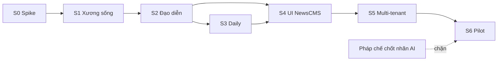

# Xưởng video quảng cáo AI — Kế hoạch tổng

> Yêu cầu: [../requirements/2026-09-15-feature-ad-video-studio.md](../requirements/2026-09-15-feature-ad-video-studio.md)
> Thiết kế: [../design/2026-09-15-feature-ad-video-studio.md](../design/2026-09-15-feature-ad-video-studio.md)
> Kiểm thử: [../testing/2026-09-15-feature-ad-video-studio.md](../testing/2026-09-15-feature-ad-video-studio.md)
> Nguồn gốc: [docs/ke-hoach-service-video-quang-cao.html](../../ke-hoach-service-video-quang-cao.html)

Khoảng **9 tuần cho 1–2 dev**. Mỗi chặng kết thúc bằng **một thứ chạy được**, không phải một thứ "gần xong".

## Milestones

- [ ] **M0 — Biết provider nào dùng được** (cuối tuần 1) · 12 video mẫu + bảng chấm điểm + kết luận VieNeu
- [ ] **M1 — Có xương sống** (cuối tuần 3) · `curl` → MP4 8 giây có giọng đọc
- [ ] **M2 — Có sản phẩm** (cuối tuần 5) · Video 30 giây nhiều cảnh, đúng nhịp thoại, chọn được định dạng
- [ ] **M3 — Có thứ khác biệt** (cuối tuần 6) · Video daily 40 giây một mạch, sản phẩm cài tự nhiên
- [ ] **M4 — Khách tự dùng được** (cuối tuần 7) · Làm video trong NewsCMS không cần dev
- [ ] **M5 — Vận hành được nhiều khách** (cuối tuần 8) · Multi-tenant + biết chi phí đô la thật
- [ ] **M6 — Có số liệu để định giá** (cuối tuần 9) · 2–3 khách thật, ≥ 50 job, tỉ lệ regenerate theo format

## Task Breakdown

Mỗi sprint có một file plan chi tiết riêng — task, step, file cần tạo/sửa, cách kiểm chứng, rủi ro.

| Sprint | Tuần | Tên | Plan chi tiết | Ra khỏi sprint |
|---|---|---|---|---|
| 0 | 1 | Spike provider | [sprint-0-spike-provider.md](./ad-video-studio/sprint-0-spike-provider.md) | 12 video mẫu + bảng chấm + danh sách giọng tuyển chọn |
| 1 | 2–3 | Xương sống | [sprint-1-xuong-song.md](./ad-video-studio/sprint-1-xuong-song.md) | `curl` → MP4 8 giây có giọng đọc |
| 2 | 4–5 | Đạo diễn & kho prompt | [sprint-2-dao-dien-kho-prompt.md](./ad-video-studio/sprint-2-dao-dien-kho-prompt.md) | Video 30 giây nhiều cảnh, chọn được định dạng |
| 3 | 6 | Định dạng daily & locale pack | [sprint-3-daily-locale-pack.md](./ad-video-studio/sprint-3-daily-locale-pack.md) | Video daily 40 giây một mạch |
| 4 | 7 | Mặt tiền trong NewsCMS | [sprint-4-mat-tien-newscms.md](./ad-video-studio/sprint-4-mat-tien-newscms.md) | Khách tự làm video, không cần dev |
| 5 | 8 | Vận hành nhiều khách | [sprint-5-van-hanh-nhieu-khach.md](./ad-video-studio/sprint-5-van-hanh-nhieu-khach.md) | Nhiều khách dùng được + biết chi phí thật |
| 6 | 9 | Pilot | [sprint-6-pilot.md](./ad-video-studio/sprint-6-pilot.md) | Số liệu thật để định giá |

### Vì sao chia sprint như vậy

- **Sprint 0 không viết service.** Mọi bảng giá đều vô nghĩa nếu output không đạt gu khách Việt. Biết điều đó trong tuần 1 rẻ hơn biết trong tuần 6. _(15/09: vì chưa có key và ngân sách, phần skeleton của Sprint 1 — thứ không cần key — được chạy trước; Sprint 0 vẫn là cổng cứng trước Sprint 2. Xem mục "Dependencies".)_
- **Sprint 2 và Sprint 3 tách ra** dù cùng là "sinh video nhiều cảnh". Định dạng daily dùng **pipeline khác hẳn** (nối frame tuần tự thay vì fan-out song song) — nhồi chung là hỏng cả hai.
- **Sprint 4 (UI) sau Sprint 3**, không trước. Dựng UI cho một API còn đang đổi hình dạng là làm hai lần.
- **Sprint 5 không có tính tiền.** Credit hoãn lại làm cùng gói bán; khách pilot dùng theo hạn mức thoả thuận. Nhưng `ProviderCall` chạy từ **Sprint 1**.

## Dependencies

### Thứ tự bắt buộc giữa các sprint

- **S0 → S1**: không viết adapter trước khi biết provider nào cho output dùng được.
  > **15/09/2026 — đổi thứ tự có kiểm soát:** chưa có key và ngân sách spike nên S1 chạy trước **phần skeleton** (entity, API, worker, Fake providers, FFmpeg, test — không cần key). Cạnh S0 → S1 vẫn đúng cho phần 🔑 (adapter chạy thật): S0 phải chạy trước khi vào S2, và chắc chắn trước S6. Chỗ dựa của việc đi trước là **D10** — mọi con số chưa kiểm chứng (rate limit, model id, provider mặc định) nằm trong DB, điền sau không cần deploy.
- **S1 → S2**: LLM đạo diễn cần pipeline đã chạy được một shot.
- **S2 → S3**: daily là biến thể của pipeline nhiều shot, không phải thứ độc lập.
- **S2 + S3 → S4**: UI dựng sau khi hợp đồng API ổn định.
- **S5 → S6**: multi-tenant phải xong trước khi có khách thật.

### Phụ thuộc bên ngoài

| Phụ thuộc | Cần khi nào | Rủi ro nếu chậm |
|---|---|---|
| Tài khoản Gemini API (Veo) có thanh toán | Sprint 0 | Chặn hoàn toàn Sprint 0 |
| Tài khoản fal.ai (Kling, Seedance, Vidu) | Sprint 0 | Chỉ so sánh được Veo |
| Tài khoản ElevenLabs (gói ≥ Creator cho PVC) | Sprint 0 (nghe mù), Sprint 5 (PVC) | Sprint 1 vẫn chạy được với gói thấp |
| **MinIO đã dựng và ổn định** | Sprint 1 | Phải thêm việc dựng storage vào Sprint 1 |
| SQL Server cho `AdVideoDb` | Sprint 1 | VPS đã có SQL Server 2022 Express |
| FFmpeg trong image worker | Sprint 1 | Bước 8 không chạy được |
| Font tiếng Việt có bản quyền thương mại | Sprint 1 (compose) | Overlay chữ không dùng được cho bản bán |
| Thư viện nhạc có giấy phép thương mại rõ ràng | Sprint 2 | Bước 8 bỏ nhạc nền tạm thời |
| **Ảnh sản phẩm thật của một khách thật** | Sprint 0 | Spike mất ý nghĩa nếu dùng ảnh stock |
| **5 người marketing chấm điểm** | Sprint 0 | Không có cơ sở chọn provider |
| **Pháp chế chốt hình thức nhãn AI** | Chặn Sprint 6 | Không mở được cho khách ngoài |
| 2–3 khách hàng đồng ý pilot | Sprint 6 | Không có số liệu định giá |

### Phụ thuộc trong code

- `IVideoProvider` + `ITtsProvider` + `ProviderCapability` phải có **từ commit đầu tiên** của Sprint 1 — không phải refactor vào sau.
- `ProviderCall` là bảng của Sprint 1, không phải của Sprint 5.
- `AdFormat` phải là **dữ liệu nạp lúc chạy** ngay từ Sprint 2 — biến từ hằng số biên dịch sang dữ liệu là việc đau đớn.
- Permission codes trong NewsCMS khai ở Sprint 4, nhưng đặt tên theo convention `Module.Subject.Action` đã có.

## Timeline & Estimates

| Sprint | Tuần | Người-ngày ước tính | Buffer |
|---|---|---|---|
| 0 — Spike provider | 1 | 5 | Ít — chủ yếu chờ render và chờ người chấm |
| 1 — Xương sống | 2–3 | 10 | Trung bình — FFmpeg và MinIO hay tốn thời gian ngoài dự tính |
| 2 — Đạo diễn & kho prompt | 4–5 | 10 | **Cao** — prompt engineering là việc lặp, khó ước lượng |
| 3 — Daily & locale pack | 6 | 5 | **Cao** — đây là phần khó nhất về mặt chất lượng đầu ra |
| 4 — Mặt tiền NewsCMS | 7 | 5 | Thấp — Razor Pages là việc đã quen trong repo này |
| 5 — Vận hành nhiều khách | 8 | 5 | Trung bình |
| 6 — Pilot | 9 | 5 | Không kiểm soát được — phụ thuộc khách |

**Tổng: ~45 người-ngày / 9 tuần.** Với 1 dev toàn thời gian là vừa khít, không có chỗ trượt. Với 2 dev thì Sprint 2 và Sprint 3 có thể chồng một phần (một người làm kho prompt, một người làm nối frame).

### Ba chỗ dễ trượt nhất

1. **Sprint 2 — prompt engineering.** "LLM sinh storyboard đúng" không có định nghĩa rõ ràng; dễ sa vào tinh chỉnh vô hạn. **Chốt cứng: 4 định dạng chạy được là đóng sprint**, tinh chỉnh chất lượng đẩy sang Sprint 6.
2. **Sprint 3 — chống trôi hình.** Nối frame là kỹ thuật chưa ai trong nhóm làm. Nếu hết tuần 6 mà daily vẫn trôi màu sau 3 đoạn, **giảm phạm vi xuống 24 giây** thay vì kéo dài sprint.
3. **Sprint 1 — FFmpeg.** Bước compose có nhiều thứ nhỏ (ducking, crossfade, burn-in font tiếng Việt, LUFS) mà mỗi thứ tốn nửa ngày. Làm bản tối thiểu trước, tinh chỉnh ở Sprint 2.

## Risks & Mitigation

Xếp theo khả năng **làm hỏng dự án**, không theo khả năng xảy ra.

| # | Rủi ro | Mức | Giảm thiểu | Chạm sprint |
|---|---|---|---|---|
| **R1** | **Provider biến mất giữa chừng.** Sora ra mắt rồi bị gỡ khỏi API trong chưa đầy một năm, không có model thay thế. | Cao | `IVideoProvider` từ commit đầu tiên; **bốn adapter đều phải chạy được thật**, không để ba cái nằm im làm cảnh; smoke test hằng ngày từng provider. Provider chết → job fail hẳn, mời khách render lại (Luật 1). | 1, 2, 5 |
| **R2** | **Thủng ví vì job chạy loạn.** Một vòng retry sai hoặc khách bấm 50 lần tiêu hàng trăm đô trong vài phút. | Cao | Trần `max_credits` mỗi job; `Idempotency-Key` bắt buộc; giới hạn số shot đồng thời; cảnh báo khi chi tiêu đô la trong ngày vượt ngưỡng. **`ProviderCall` là nguồn sự thật về chi phí, credit không phải.** | 1, 5 |
| **R3** | **Quảng cáo sai quy định.** LLM viết lời thoại sẽ vô tư sinh ra "số 1 Việt Nam". Khách trải rộng nhiều ngành nên không duyệt trước theo ngành được. | Cao | Bộ lọc cụm từ cấm chạy trên lời thoại **trước** khi TTS; ghi nhận khách chấp nhận điều khoản ở **từng job**, không phải một lần lúc đăng ký; lưu vết ai tạo video nào với lời thoại nào. Ngành nhạy cảm (dược, TPCN, mỹ phẩm) dùng cờ bật riêng cho tenant. | 2, 5 |
| **R4** | **Nghĩa vụ gắn nhãn AI.** Luật TTNT 2025 hiệu lực từ 1/3/2026 — **đã đang áp dụng**. Phạt tới 2 tỉ đồng với tổ chức. Nghĩa vụ thuộc bên triển khai, **không chuyển sang khách được** bằng điều khoản. | Cao | Nhãn + metadata vào **bước compose**, không phải bước tuỳ chọn (D9). Mặc định bật, khách không tắt được. QC fail nếu thiếu. *Cần pháp chế đọc bản gốc và chốt hình thức nhãn — chặn Sprint 6.* | 1, 6 |
| **R5** | **Quyền hình ảnh cá nhân.** Khách upload ảnh KOL chưa đồng ý; rủi ro thuộc nền tảng chứ không thuộc khách. | TB | `consent_ref` bắt buộc khi có `talent`; ghi IP, thời điểm, tài khoản khi khách xác nhận; điều khoản nêu rõ trách nhiệm. *Veo vốn đã tự chặn ảnh có mặt người — đó là tín hiệu về mức rủi ro.* | 1, 5 |
| **R6** | **Khách nhân bản giọng người khác.** IVC chỉ cần < 2 phút ghi âm, **không có xác minh chính chủ**. Giọng nói là dữ liệu sinh trắc học — xử lý nặng hơn hình ảnh. VieNeu tự host còn nặng hơn: clone từ 3–8 giây, **không có lớp kiểm duyệt nào của nhà cung cấp**. | Cao | Mọi lần tạo giọng sinh một `ConsentRecord` (tài khoản, IP, thời điểm, tên người chủ giọng); chặn tái sử dụng giọng của tenant này ở tenant khác; khuyến khích PVC (ElevenLabs tự chạy voice-captcha). Có quy trình gỡ giọng khi bị khiếu nại. | 5 |
| **R7** | **Chờ lâu, khách bỏ đi.** Video 60 giây mất 8–15 phút. | TB | UI hiện **từng shot ngay khi render xong** (`job.shot_completed`); email/thông báo khi hoàn tất; luôn có tier draft trả kết quả trong ~2 phút. | 4 |
| **R8** | **Storage phình nhanh hơn dự tính.** Mỗi video giao cho khách kéo theo 5–10 file trung gian. | TB | Vòng đời lưu trữ **ngay từ đầu**: `adv-work` xoá sau 7 ngày, `adv-final` sang lớp lạnh sau 90 ngày. *Đây là lý do không dùng `wwwroot/uploads`.* | 1 |
| **R9** | **Chữ tiếng Việt bị model vẽ sai.** Gần như chắc chắn xảy ra nếu để model tự vẽ. | Thấp | Đã xử lý bằng D4 — negative prompt "no text" toàn cục + QC bước 9 quét khung hình bắt chữ lọt lưới. Cùng họ vấn đề: giọng đọc sai tên riêng sửa bằng `PronunciationDictionary`. | 1, 2 |

### Rủi ro về tiến độ (khác với rủi ro sản phẩm)

| Rủi ro | Dấu hiệu sớm | Phản ứng |
|---|---|---|
| Sprint 0 kết luận **không provider nào đạt gu khách** | Bảng chấm điểm dưới 3/5 ở mọi provider | Dừng lại, xem lại giả định sản phẩm. Vì Sprint 1 skeleton đã đi trước (15/09), một phần công sức đã bỏ — nhưng xương sống đó **không gắn chết với provider nào** (D2), nên vẫn dùng lại được nếu tìm ra hướng khác. Không đốt thêm tiền trước khi giả định được xác nhận |
| **Sprint 1 thiết kế trên phỏng đoán** (chưa có số liệu spike) | Adapter viết theo tài liệu, chưa từng gọi thật; rate limit/model id là giá trị bảo toàn | D10 — mọi con số chưa kiểm chứng nằm trong DB, điền sau không cần deploy. **Cổng cứng: không vào Sprint 2 khi chưa chạy adapter thật.** Có key là chạy Sprint 0 + verification 🔑 ngay, không đợi "tiện thể" |
| VieNeu không có timing và license không rõ | Kết luận Sprint 0 | 🟡 License đã tra xong 15/09 (Apache-2.0, thương mại OK tới v2-Turbo). Còn cửa timing: giới hạn VieNeu ở tier Nháp; ElevenLabs gánh toàn bộ bản thành phẩm (tăng chi phí biên) |
| Rate limit provider thấp hơn dự tính nhiều | Đo được ở Sprint 0 | Thiết kế lại phần scale trước khi code Sprint 1, không phải sau |
| Sprint 3 daily vẫn trôi hình cuối tuần 6 | 3 video mẫu đều trôi màu sau đoạn 3 | Giảm phạm vi xuống 24 giây, không kéo dài sprint |
| Pháp chế chưa chốt nhãn AI đến tuần 9 | Không có phản hồi đến hết tuần 7 | Pilot nội bộ thay vì pilot với khách ngoài |

## Resources Needed

### Người

| Vai | Ai | Cần khi nào |
|---|---|---|
| Dev chính (.NET) | 1–2 người | Toàn bộ 9 tuần |
| Người chấm điểm output | 5 người làm marketing | Sprint 0 (nửa ngày), Sprint 3, Sprint 6 |
| Biên tập thư viện bối cảnh | 1 người Việt có mắt nhìn | Sprint 3 (chủ yếu), Sprint 6 |
| Pháp chế | 1 người | Đọc Luật TTNT 2025, chốt hình thức nhãn — trước tuần 9 |
| Khách hàng pilot | 2–3 doanh nghiệp | Sprint 6; ảnh sản phẩm thật cần từ Sprint 0 |

### Tài khoản & dịch vụ

- Gemini API (Veo) — có thanh toán
- fal.ai — Kling, Seedance, Vidu qua một API key
- ElevenLabs — gói ≥ Creator (cho Professional Voice Clone ở Sprint 5)
- LLM cho lớp đạo diễn
- Ngân sách spike Sprint 0: ước tính **$50–100** cho 12 video mẫu qua 4 provider

### Hạ tầng

- VPS Ubuntu (đã có) — SQL Server 2022 Express, nginx
- MinIO (đã chốt, dựng riêng) — 4 bucket + lifecycle rule + NTP
- Image worker có **FFmpeg**
- Worker tách biệt cho VieNeu-TTS nếu tự host (không dùng chung CPU với FFmpeg)

### Tài sản

- **Ảnh sản phẩm thật của một khách hàng thật** — Sprint 0, không thay bằng ảnh stock được
- Font tiếng Việt có bản quyền thương mại — cho overlay chữ
- Thư viện nhạc có giấy phép thương mại rõ ràng
- ~30 entry `SceneEntry` hạt giống cho thư viện bối cảnh Việt Nam

## Tiến độ

Cập nhật bằng `/update-planning` sau mỗi task. Bảng này là nguồn sự thật về "đang ở đâu".

> **Kiểm kê ngày 25/09/2026:** [ad-video-studio/trang-thai-va-lo-trinh-2026-09-25.md](./ad-video-studio/trang-thai-va-lo-trinh-2026-09-25.md)
> — đối chiếu từng hạng mục của 7 sprint với code, năm lỗ hổng chặn đường, và năm đợt triển khai tiếp.

| Sprint | Trạng thái | Ghi chú |
|---|---|---|
| 0 — Spike provider | 🔶 **Blocked một phần** (25/09) | `FAL_KEY` đã có từ 16/09 → Kling/Seedance/Vidu chạy được ngay (Đợt C). Còn chặn: Gemini (Veo) và ElevenLabs chưa có key, VieNeu chưa self-host nên Cửa 1 (timing) chưa trả lời. 7 script + 4 khung kết quả đã viết, **chưa chạy lần nào** |
| 1 — Xương sống | 🟡 **~80%** (25/09) | Xương sống chạy thông thật: 243 test xanh, 12 test integration đi hết 1→4→5→6→8→9 với FFmpeg thật; nhãn AI, D10, hàng rào chi phí, idempotency đều có test. **Chặn: chưa có một migration EF nào** → `migrate` tạo 0 bảng, `docker compose up` không lên được. Thêm: 0 test cho 4 adapter + toàn bộ Api; `adv-work` thiếu lifecycle |
| 2 — Đạo diễn & kho prompt | ⬜ ~10% | T2.9 xong; T2.8 gần xong (4 provider đã nối). Cổng 🔑 đọc lại là **"không ĐÓNG Sprint 2 bằng provider giả"**, không phải "không mở" — ~70% khối lượng là code thuần, làm được ngay (Đợt D) |
| 3 — Daily & locale pack | ⬜ ~5% | Phải sửa `Layout` của `TimelineLocker` trước: ngưỡng lệch 200 ms hiện là mã chết với `PadPerShot` |
| 4 — Mặt tiền NewsCMS | ⬜ 0% | Không chỉ thiếu UI: AdVideo thiếu **≥ 8 endpoint** UI cần, chưa có đường upload ảnh, chưa sinh thumbnail. Cần chèn một đợt "API cho mặt tiền" trước |
| 5 — Vận hành nhiều khách | ⬜ ~15% | Chỉ multi-tenant chạy thật (chưa có test cross-tenant). `TenantQuota` nên lên sớm: hiện chỉ có trần toàn hệ thống, một khách tiêu hết là mọi khách 503 |
| 6 — Pilot | ⬜ 0% | Chặn kép: pháp chế chưa chốt nhãn AI, và chưa có `FormatUsageStat` nên tỉ lệ render lại không đo được |
