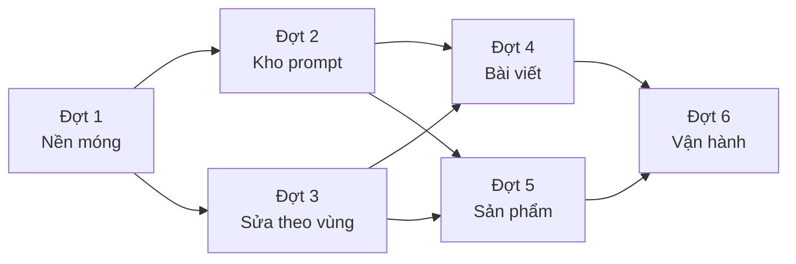

# Xưởng ảnh AI (ImageStudio) — Kế hoạch triển khai

> Yêu cầu: [../requirements/2026-09-29-feature-ai-image-studio.md](../requirements/2026-09-29-feature-ai-image-studio.md)
> Thiết kế: [../design/2026-09-29-feature-ai-image-studio.md](../design/2026-09-29-feature-ai-image-studio.md)

Khoảng **25 người-ngày, tức ~5 tuần cho 1 dev**. Mỗi đợt kết thúc bằng **một thứ bấm được trên màn
hình**, không phải một thứ "gần xong". Đợt nào bắt đầu thì viết plan chi tiết riêng vào
`docs/ai/planning/image-studio/dot-N-….md`, theo cách AdVideo đã làm với các đợt F–I.

> **29/09 — chốt với chủ sản phẩm:**
> - **Bỏ Đợt 0 (spike).** Vào thẳng Đợt 1. Model id, giá, kích thước là dữ liệu admin nhập ở màn hình (D2), nên chọn sai model chỉ là sửa một dòng, không phải sửa code. Những việc spike định kiểm (XMP của ImageSharp, quy ước mask) chuyển thành test tự động trong đợt tương ứng.
> - **Chọn model giống chọn giọng đọc của VideoStudio:** SuperAdmin cấu hình sẵn vài model (tên, mô tả, giá ước tính); người dùng chọn một trong các model đó ở form tạo ảnh.
> - **Mẫu prompt có ảnh demo** (Đợt 2): mỗi mẫu có ảnh minh hoạ để người dùng thấy trước kết quả.
>
> **29/09 — chốt thêm:** Q3 chú thích AI là đủ, không watermark · Q4 kho mẫu dùng chung toàn hệ thống · Q6 SuperAdmin dùng toàn bộ, vai trò khác do quản trị cấp · Q7 giữ 14 ngày · Q8 số ảnh trong bài do AI quyết theo nội dung · Q2 hạn mức theo gói khách mua (chờ Q10: cách làm gói).

## Milestones

- [x] **M1 — Tạo được ảnh từ chữ** (Đợt 1, xong 29/09 — [dot-1-nen-mong-2026-09-29.md](./image-studio/dot-1-nen-mong-2026-09-29.md)) · `/Admin/ImageStudio` → 2 biến thể → "Dùng ảnh này" → ảnh nằm trong thư viện media, có metadata AI
- [x] **M2 — Có kho prompt** (Đợt 2, xong 29/09 — [dot-2-kho-mau-2026-09-29.md](./image-studio/dot-2-kho-mau-2026-09-29.md)) · mẫu có ảnh demo, chọn mẫu "Đang trend", "Cải thiện prompt", trend tự cập nhật
- [ ] **M3 — Sửa được ảnh theo vùng đánh số** (Đợt 3) · khoanh #1 #2, chỉ dẫn từng vùng, phần ngoài vùng giữ nguyên từng điểm ảnh
- [ ] **M4 — Bài viết hoàn chỉnh có ảnh** (Đợt 4) · khung chat trả bài + ảnh bìa + ảnh trong bài, lưu nháp
- [ ] **M5 — Ảnh sản phẩm** (Đợt 5) · ảnh đại diện, gallery, "từ ảnh chụp thật, giữ nguyên sản phẩm"
- [ ] **M6 — Vận hành được** (Đợt 6) · hạn mức, báo cáo chi phí, dọn file, nhãn AI, bot Telegram dùng chung lớp provider

## Task Breakdown

### Đợt 1 — Nền móng: tạo ảnh từ chữ, hàng đợi, promote (5 ngày)

> **Xong 29/09.** Kết quả, khác biệt so với thiết kế và cách chạy với nhà cung cấp thật: [image-studio/dot-1-nen-mong-2026-09-29.md](./image-studio/dot-1-nen-mong-2026-09-29.md).

| # | Việc | File |
|---|---|---|
| 1.1 | Entity + enum: `ImageModel`, `ImageJob`, `ImageJobOutput`, `ImageProviderCall`, `ImageStudioSiteSettings` | `NewsCMS.Domain/Entities/ImageStudio/*.cs` |
| 1.2 | Thêm `Media.Origin`, `Media.AiJobId` | `Media.cs`, `MediaConfiguration.cs` |
| 1.3 | Cấu hình EF, `DbSet`, migration `AddImageStudio` (có index như thiết kế mục 3.2) | `Persistence/Configurations/ImageStudioConfiguration.cs`, `AppDbContext.cs`, `Persistence/Migrations/` |
| 1.4 | Hợp đồng Application: DTO, `IImageStudioService`, `IImageModelService`, `IImageProvider` + request/result | `NewsCMS.Application/ImageStudio/**` |
| 1.5 | `OpenAiImageProvider.GenerateAsync` (dùng được cho 9Router và OpenAI), `FakeImageProvider` (chỉ bật ở Development), `ImageProviderRegistry` | `Infrastructure/ImageStudio/Providers/*.cs` |
| 1.6 | `ImageDownloadGuard` (chặn SSRF), `ImageNormalizer`, `AiMetadataWriter` | `Infrastructure/ImageStudio/Imaging/*.cs` |
| 1.7 | `ImageJobQueue` + `ImageJobWorker` (`MaxConcurrency`, nhận job bằng update có điều kiện, quét lại lúc khởi động) + `ImageJobRunner` (chế độ Generate) | `Infrastructure/ImageStudio/Jobs/*.cs`, `DependencyInjection.cs` |
| 1.8 | `ImageStudioService`: Create (quyền, model được phép, **hạn mức**, idempotency, chi phí ước tính), Status, Promote (vào thư mục "Ảnh AI"), Cancel | `Infrastructure/ImageStudio/ImageStudioService.cs` |
| 1.9 | Permission `ImageStudio.Image.View/Create`, `ImageStudio.Settings.Manage`; seed qua `Permissions.All()` | `Permissions.cs` |
| 1.10 | Trang **Config/Models** (danh sách, thêm/sửa: tên hiển thị, mô tả cho người dùng, kết nối, model id, giá, "Chạy thử") và **Config/Sites** (bật/tắt, hạn mức) cho SuperAdmin; `_ImageStudioConfigNav` | `Areas/Admin/Pages/ImageStudio/Config/*` |
| 1.11 | Trang `/Admin/ImageStudio` (lịch sử job, tìm/lọc/phân trang) và `Detail`. `_ImageStudioModal` bản đầu: tab "Tạo mới" với prompt tự viết, chọn model, khung, số biến thể, chi phí ước tính, poll trạng thái, "Dùng ảnh này". Mục sidebar | `Areas/Admin/Pages/ImageStudio/*`, `Shared/_ImageStudioModal.cshtml`, `wwwroot/js/admin/image-studio.js`, `_Sidebar.cshtml`, `_AdminLayout.cshtml` |
| 1.12 | Test (mục Kiểm thử) + build lại `admin.css` (`npm run css:admin`) | `tests/NewsCMS.Tests/ImageStudio/*` |

**Ra khỏi đợt:** SuperAdmin thêm model 9Router và bấm "Chạy thử" ra ảnh. Người có quyền vào
`/Admin/ImageStudio` tạo 2 biến thể và chọn một. Ảnh đó có trong thư viện media ở thư mục "Ảnh AI" với
`Origin = ai-generated`, và `exiftool` thấy `DigitalSourceType`. Vượt hạn mức thì bị chặn trước khi gọi
provider.

### Đợt 2 — Kho prompt mẫu, trend, prompt tự viết (3 ngày)

> **Xong 29/09.** 2.10 (mẫu riêng của site) bỏ — chốt Q4: kho mẫu dùng chung toàn hệ thống. Kết quả và kiểm chứng: [image-studio/dot-2-kho-mau-2026-09-29.md](./image-studio/dot-2-kho-mau-2026-09-29.md).

| # | Việc | File |
|---|---|---|
| 2.1 | **Commit riêng:** tách `AdContentRules` (cụm quảng cáo tuyệt đối, ngành nhạy cảm) ra khỏi `VideoPromptTemplateRules`. Test video giữ nguyên xanh | `Application/Ai/PromptLibrary/AdContentRules.cs`, `VideoPromptTemplateRules.cs` |
| 2.2 | Tách helper lập lịch, khoá và đọc JSON của trend ra dùng chung; `VideoPromptTrendService` chuyển sang dùng helper | `Infrastructure/Ai/PromptLibrary/*.cs` |
| 2.3 | Entity `ImagePromptTemplate`, `ImagePromptLibrarySettings` (có `BlockedTermsJson`), `ImagePromptTrendRun` + migration | Domain, Configurations, Migrations |
| 2.4 | `ImagePromptTemplateRules` (chỗ giữ theo mục đích, tên người thật, phong cách nghệ sĩ/thương hiệu, khung hình, cảnh báo chữ trong ảnh) | `Application/ImageStudio/ImagePromptTemplateRules.cs` |
| 2.5 | `ImagePromptLibraryService` + `ImagePromptLibrarySeeder` (~16 mẫu, chỉ thêm, không ghi đè) | `Infrastructure/ImageStudio/*` |
| 2.6 | `ImagePromptTrendService` + `ImagePromptTrendWorker`. Seed skill `imagestudio_trend_templates` (UseTools), `imagestudio_prompt_enhance`, `imagestudio_suggest_prompt`; thêm hằng vào `AiTaskKeys` | `Infrastructure/ImageStudio/*`, `AiEnums.cs`, `DbSeeder.cs` |
| 2.7 | Trang **Config/Templates**, **TemplateEdit**, **Trend** (bật tự cập nhật, "Cập nhật ngay", lịch sử chạy, duyệt/ẩn) | `Areas/Admin/Pages/ImageStudio/Config/*` |
| 2.8 | Modal: khối kho mẫu (tìm, lọc "Đang trend"/ngành/mục đích), "Dùng mẫu này" (điền chỗ giữ từ ngữ cảnh), "Cải thiện prompt" (xem trước/sau), cộng `UsageCount` khi job thành công | `image-studio.js`, handler trong `ImageStudio/Index.cshtml.cs` |
| 2.9 | **Ảnh demo cho mẫu:** cột `DemoMediaId`/`DemoImageUrl`. Trang Templates có nút "Tạo ảnh demo" (chạy mẫu với chủ đề/sản phẩm ví dụ bằng model mặc định, lưu vào thư mục hệ thống) hoặc "Tải ảnh demo lên"; nút "Tạo demo cho mọi mẫu chưa có" (hiện tổng chi phí trước khi chạy). Mẫu trend: tuỳ chọn "Tự tạo ảnh demo cho mẫu trend mới" trong cài đặt kho, có trần số ảnh mỗi lần chạy. Modal hiện ảnh demo dạng lưới thẻ | `ImagePromptTemplate.cs`, `ImagePromptLibraryService`, `Config/Templates*`, `image-studio.js` |
| 2.10 | ~~Mẫu riêng của site~~ — **không làm** (chốt Q4 ngày 29/09: kho mẫu dùng chung toàn hệ thống) | |

**Ra khỏi đợt:** modal hiện mẫu theo mục đích, dạng thẻ có ảnh demo. "Dùng mẫu này" điền đúng tên chủ đề hoặc sản phẩm; còn chỗ
giữ chưa điền thì bị chặn kèm lời nhắc. "Cải thiện prompt" chạy được. "Cập nhật ngay" thêm mẫu đạt và
loại mẫu vi phạm, có ghi lý do. Test kho video vẫn xanh.

### Đợt 3 — Ảnh mẫu và sửa theo vùng đánh số (6 ngày)

> **Kế hoạch chi tiết (29/09):** [image-studio/dot-3-sua-theo-vung-2026-09-29.md](./image-studio/dot-3-sua-theo-vung-2026-09-29.md) — chia 3.0 + 3A–3G, ước tính lại **7,5–8 ngày** (thêm: demo hàng loạt chạy nền, bảng ảnh tải lên, "Chạy thử sửa ảnh", adapter Gemini). Gọn về 6 ngày được nếu bỏ trang sửa toàn trang và dời Gemini.

| # | Việc | File |
|---|---|---|
| 3.1 | Tab "Từ ảnh mẫu": tải lên (kéo thả, giải mã lại bằng ImageSharp, ≤ 15 MB, ≤ 40 MP), chọn từ thư viện, tick quyền sử dụng (lưu ai, lúc nào, IP nào); chế độ `Reference` trong runner | modal, `ImageStudioService`, `ImageJobRunner` |
| 3.2 | Hợp đồng `ImageEditRequest` + `ImageRegionValidator` (thuần hàm) | `Application/ImageStudio/ImageRegion*.cs` |
| 3.3 | `SizeFitter` (pad và khôi phục), `RegionMaskBuilder` (chữ nhật, cọ, trừ vùng keep, viền mềm, 2 quy ước mask), `RegionAnnotationRenderer` (bảng 8 màu, huy hiệu #N) | `Infrastructure/ImageStudio/Imaging/*.cs` |
| 3.4 | `RegionPromptComposer` (vị trí bằng lời + phần trăm, vùng giữ, chỉ dẫn chung, dòng "không vẽ dấu đánh dấu") | `Application/ImageStudio/RegionPromptComposer.cs` |
| 3.5 | `RegionCompositor` (ghép lại điểm ảnh gốc ngoài vùng) | `Imaging/RegionCompositor.cs` |
| 3.6 | Runner chế độ `RegionEdit`: tự chọn mask hay ảnh đánh dấu theo năng lực model; chiến lược `Single`/`Sequential`; chi phí ước tính × số lần gọi | `ImageJobRunner.cs` |
| 3.7 | Adapter: `OpenAiImageProvider.EditAsync` (multipart `image[]` + `mask`); `GeminiImageProvider` và `FalImageProvider` (tối thiểu một cái, tuỳ key đang có — Q1) | `Providers/*.cs` |
| 3.8 | `image-region-editor.js`: chữ nhật, cọ, tẩy, chọn/di chuyển, hoàn tác, phóng to, cảm ứng; bảng vùng (#N, Sửa/Giữ nguyên, chỉ dẫn), dồn số khi xoá, rê chuột sáng hai chiều, xem trước bản đánh dấu | `wwwroot/js/admin/image-region-editor.js`, `Styles/admin.css` |
| 3.9 | Chuỗi phiên bản ("Sửa tiếp", `ParentJobId`/`SourceOutputId`), thanh trượt so sánh trước/sau | modal, `Detail.cshtml` |
| 3.10 | Trang trình sửa toàn trang `/Admin/ImageStudio/Edit?mediaId=`; nút "Sửa bằng AI" ở `Media/Edit`; lọc "Ảnh AI" ở `Media/Index`; kết quả là `Media` mới cùng thư mục (không ghi đè) | `ImageStudio/Edit.cshtml*`, `Media/Edit.cshtml`, `Media/Index.cshtml*`, `MediaService.SearchAsync` |

**Ra khỏi đợt:** mở một ảnh trong thư viện, khoanh #1 (chữ nhật, "đổi áo thành đỏ") và #2 (cọ, "xoá
logo"), xoá #1 thì #2 thành #1. Bấm Tạo → nhận ảnh mới, thư viện có thêm một `Media`, ảnh gốc giữ
nguyên. Test chứng minh 100% điểm ảnh ngoài mask (trừ viền) giống ảnh gốc. Chạy được với ít nhất hai
adapter: một adapter dùng mask, một adapter dùng ảnh đánh dấu.

### Đợt 4 — Tích hợp bài viết (4 ngày)

| # | Việc | File |
|---|---|---|
| 4.1 | `MediaPickerOptions.AiPurpose/AiContextSelectors`; nút "✨ Tạo bằng AI" trong `_MediaPicker` (kiểm quyền); ảnh đại diện bài dùng `post-cover` | `MediaPickerOptions.cs`, `_MediaPicker.cshtml`, `Posts/Create|Edit.cshtml` |
| 4.2 | Handler "Gợi ý từ nội dung" → skill `imagestudio_suggest_prompt` → `{prompt, alt, caption}` | `ImageStudio/Index.cshtml.cs`, `ImageStudioService` |
| 4.3 | TinyMCE: nút `aiImage` (chèn `figure` + `img` + `figcaption` tại con trỏ); menu ngữ cảnh trên ảnh "Sửa bằng AI" (tra `Media` bằng `GetByPathAsync`; ảnh ngoài thư viện thì hướng dẫn nhập vào trước) | `_TinyMce.cshtml`, `TinyMceOptions.cs` |
| 4.4 | Bài hoàn chỉnh: **số ảnh và vị trí do AI quyết theo nội dung bài, không giới hạn cứng** (chốt Q8) — chỉ hạn mức của gói giới hạn; khung chat hiện chi phí ước tính và cho bỏ bớt ảnh đề xuất trước khi "Tạo tất cả ảnh". `AiChatRequest` thêm cờ `IncludeImages`; hợp đồng JSON `article_chat` thêm `images[]` và ô chờ `figure.ai-image-slot#ai-slot-N`; `AiChatResponseParser` đọc `images`; khung chat thêm tuỳ chọn "Kèm ảnh minh hoạ", thẻ từng ảnh (sửa được prompt), "Tạo tất cả ảnh", "Áp dụng" (ảnh bìa vào picker, ô chờ thay bằng `img` + chú thích AI) | `AiChatDtos.cs`, `AiCompletionService.cs`, `AiChatResponseParser.cs`, `Ai/Generate.cshtml.cs`, `ai-assist.js` |
| 4.5 | `PostService.Create/UpdateAsync` gỡ `figure.ai-image-slot` không có `img` | `PostService.cs` |

**Ra khỏi đợt:** trong trang Tạo bài, gõ vào khung chat "viết bài về cà phê muối Huế, kèm ảnh bìa và 2 ảnh
minh hoạ" → nhận tiêu đề, tóm tắt, nội dung và 3 thẻ ảnh → "Tạo tất cả ảnh" → "Áp dụng" → form có ảnh đại
diện và 2 `figure` có ảnh trong nội dung. Lưu ra bài Nháp. Lưu khi ảnh chưa xong thì trong DB không còn ô
chờ nào.

### Đợt 5 — Tích hợp sản phẩm (3 ngày)

| # | Việc | File |
|---|---|---|
| 5.1 | Ảnh đại diện sản phẩm: `_MediaPicker` với `AiPurpose = "product-main"`, ngữ cảnh gồm tên, mô tả ngắn, danh mục | `_ProductForm.cshtml` |
| 5.2 | Gallery: nút "Thêm ảnh AI", `multiple: true`, đổ kết quả vào `addImage` | `product-form.js`, `_ProductForm.cshtml` |
| 5.3 | Tab "Từ ảnh mẫu" liệt kê sẵn ảnh của sản phẩm đang sửa | `image-studio.js` |
| 5.4 | Mẫu `KeepSubject`: trình sửa tạo sẵn vùng #1 "Giữ nguyên" kèm hướng dẫn "Khoanh sản phẩm"; mask = mọi thứ trừ sản phẩm; tinh chỉnh viền mềm để không có quầng ở mép sản phẩm | `image-region-editor.js`, `RegionMaskBuilder`, seed mẫu |

**Ra khỏi đợt:** từ ảnh chụp điện thoại của một sản phẩm thật: khoanh sản phẩm, chọn "Nền trắng TMĐT" →
ảnh mới có nền sạch, **nhãn và bao bì giống hệt ảnh gốc**. Thêm 3 ảnh lifestyle vào gallery rồi lưu sản
phẩm.

### Đợt 6 — Vận hành (3 ngày)

| # | Việc | File |
|---|---|---|
| 6.1 | ~~Hiện "còn N ảnh" trong modal~~ (đã có từ Đợt 1). **Hạn mức theo gói khách mua** (chốt Q2, cách làm chờ Q10); cảnh báo khi chi phí trong ngày vượt ngưỡng | modal, `ImageStudioService` |
| 6.2 | Trang **Config/Usage**: ảnh và chi phí theo site, model, tháng; tỉ lệ lỗi theo mã lỗi | `ImageStudio/Config/Usage.cshtml*` |
| 6.3 | `ImageOutputCleanupWorker`: output chưa promote xoá sau 14 ngày, mask và ảnh đánh dấu sau 7 ngày | `Jobs/ImageOutputCleanupWorker.cs` |
| 6.4 | Trang **SiteSettings** (phong cách thương hiệu, khung mặc định, chữ chú thích AI); helper `IsAiGenerated` cho theme. **Không watermark** (chốt Q3) | `ImageStudio/SiteSettings.cshtml*` |
| 6.5 | Bot Telegram: `ImageGenerationTool` gọi `IImageStudioService.RunInlineAsync`; nếu chưa có model mặc định thì rơi về cấu hình skill cũ | `Ai/Tools/ImageGenerationTool.cs` |
| 6.6 | E2E Playwright trình đánh dấu vùng; chạy thật toàn luồng bằng Chromium (như Đợt G/I) | `tests/e2e/image-region-editor.spec.cjs` |
| 6.7 | Tài liệu `implementation`, `testing`, `deployment`, `monitoring` cho ImageStudio; cập nhật trạng thái kế hoạch | `docs/ai/*/2026-09-29-feature-ai-image-studio.md` |

**Ra khỏi đợt:** SuperAdmin xem được chi phí tháng này của từng site. File rác tự dọn. Bot Telegram vẫn
tạo được ảnh và lần tạo đó hiện trong báo cáo.

## Kiểm thử

Theo cách đang làm ở `tests/NewsCMS.Tests/VideoStudio`: xUnit, InMemory, `HttpMessageHandler` giả.
Test nằm trong `tests/NewsCMS.Tests/ImageStudio/`.

| Nhóm | Test chính | Đợt |
|---|---|---|
| Ảnh | `RegionMaskBuilderTests` (chữ nhật, cọ, trừ vùng keep, 2 quy ước mask, viền mềm) · `RegionCompositorTests` (**điểm ảnh ngoài mask giống hệt ảnh gốc**) · `SizeFitterTests` (pad rồi khôi phục đúng kích thước) · `RegionAnnotationRendererTests` · `ImageNormalizerTests` (EXIF, bom giải nén) · `AiMetadataWriterTests` (đọc lại được XMP) | 1, 3 |
| Luật | `ImageRegionValidatorTests` · `RegionPromptComposerTests` · `ImagePromptTemplateRulesTests` · test video cũ vẫn xanh sau khi tách `AdContentRules` | 2, 3 |
| Provider | `OpenAiImageProviderTests` (body JSON của generate; multipart của edits có `image[]` và `mask`; header auth; ánh xạ lỗi; **không lộ key trong lỗi**) · `GeminiImageProviderTests` / `FalImageProviderTests` (poll, timeout) · `ImageDownloadGuardTests` (IP nội bộ, quá cỡ, không phải ảnh) | 1, 3 |
| Service | `ImageStudioServiceTests`: hạn mức, idempotency, truy cập chéo site, chỗ giữ chưa điền, promote bấm hai lần, huỷ · `ImageJobRunnerTests` với Fake: thành công, provider lỗi → `Failed` + `ImageProviderCall`, 429 chỉ thử lại một lần, quét lại lúc khởi động | 1, 3 |
| Kho mẫu | `ImagePromptLibraryTests`, `ImagePromptTrendTests` (theo khuôn `VideoPromptLibraryTests`) | 2 |
| Bài viết | mở rộng `AiChatResponseParserTests` cho `images[]` · `PostService` gỡ ô chờ | 4 |
| E2E | `image-region-editor.spec.cjs`: vẽ 2 vùng, dồn số khi xoá, chuyển Giữ nguyên, payload có toạ độ chuẩn hoá | 6 |

Mỗi đợt kết thúc bằng `dotnet test` xanh toàn bộ và một lần **chạy thật qua trình duyệt** trên SQL Server
2022. Dùng Fake provider, hoặc server giả theo chuẩn OpenAI như Đợt I; có key thì chạy với key thật. Kết
quả ghi vào file plan của đợt.

## Dependencies

- **Đợt 1 chạy được ngay** với 9Router (đã có) hoặc Fake provider.
- **Đợt 2 và Đợt 3 làm song song được** nếu có 2 dev: một người lo kho mẫu, một người lo xử lý ảnh.
- **Đợt 4 cần Đợt 3** cho tính năng "Sửa ảnh trong bài". Phần ảnh đại diện và chèn ảnh (4.1–4.3 trừ phần
  sửa) làm được ngay sau Đợt 2.
- **Hạn mức (1.8) nằm ở Đợt 1, không phải Đợt 6.** Không có dòng code nào gọi provider thật mà chưa qua
  hạn mức.

### Phụ thuộc bên ngoài

| Phụ thuộc | Cần khi | Nếu chậm |
|---|---|---|
| Key 9Router (đã có, đang dùng cho Telegram) | Đợt 1 | Dùng Fake; chưa có "chạy thật" |
| Key thêm một provider có năng lực khác (Gemini hoặc fal) | Đợt 3 | Chỉ có một adapter chạy thật; chưa đạt tiêu chí "không phụ thuộc một provider" |
| Ảnh sản phẩm thật của một khách | Đợt 5 | Thử bằng ảnh stock thì mất ý nghĩa phần giữ nguyên sản phẩm |
| 2–3 biên tập viên dùng thử | cuối Đợt 3 | Chọn model mặc định theo cảm tính (đổi được trên màn hình) |
| Pháp chế chốt nhãn AI hiển thị (Q3) | Trước khi mở cho khách ngoài | Metadata vẫn ghi; chú thích mặc định bật |

## Timeline & Estimates

| Đợt | Người-ngày | Buffer | Ghi chú |
|---|---|---|---|
| 1 — Nền móng | 5 | Trung bình | Nhiều file nhưng theo khuôn đã có (VideoStudio, AiConnection) |
| 2 — Kho prompt + ảnh demo | 4 | Thấp | Bản video đã chạy; rủi ro chỉ ở phần tách code dùng chung |
| 3 — Sửa theo vùng | 6 → **7,5–8** (kế hoạch chi tiết) | **Cao** | Trình vẽ canvas, `SizeFitter`/ghép lại, và chất lượng bên trong vùng phụ thuộc model |
| 4 — Bài viết | 4 | Trung bình | Đụng `ai-assist.js` (501 dòng) và hợp đồng chat đang chạy |
| 5 — Sản phẩm | 3 | Trung bình | Chỉnh viền mềm quanh sản phẩm tốn thời gian thử |
| 6 — Vận hành | 3 | Thấp | |

**Tổng: ~25 người-ngày.** 1 dev làm liên tục thì mất ~5 tuần; 2 dev thì khoảng 4 tuần, vì Đợt 2 và Đợt 3
chạy song song.

### Ba chỗ dễ trượt nhất

1. **Đợt 3: chất lượng bên trong vùng với model chỉ sửa bằng lời.** Ảnh đánh dấu là cách gián tiếp; model
   có thể sửa lệch chỗ. **Chốt cứng:** phần ngoài vùng đã được D5 bảo đảm. Nếu bên trong vùng chưa đạt thì
   mặc định dùng model có mask cho chế độ sửa vùng, và để `Sequential` làm lựa chọn "chính xác hơn".
   Không kéo dài đợt để tinh chỉnh prompt.
2. **Đợt 3: `SizeFitter` với model kích thước cố định.** Pad rồi cắt dễ lệch 1 px giữa mask, ảnh gốc và kết
   quả. Viết test làm tròn ngay từ đầu.
3. **Đợt 4: hợp đồng JSON của chat.** Thêm `images[]` có thể làm model trả JSON sai nhiều hơn.
   `AiChatResponseParser` phải chịu được việc thiếu `images` (coi như bài không có ảnh). Không bao giờ làm
   hỏng luồng soạn bài đang chạy.

## Risks & Mitigation

| # | Rủi ro | Mức | Giảm thiểu | Đợt |
|---|---|---|---|---|
| R1 | **Model bị khai tử hoặc đổi API** | Cao | Model là dữ liệu (D2); ≥ 2 adapter chạy thật; nút "Chạy thử" và `LastTestOk` hiện trên trang Model | 1, 3 |
| R2 | **Thủng ví** (bấm nhiều lần, retry sai, `Sequential` N vùng) | Cao | Hạn mức kiểm trước khi gọi; `IdempotencyKey`; `MaxVariants`, `MaxConcurrency`; D10; chi phí ước tính hiện trước khi bấm; `ImageProviderCall` là nguồn sự thật | 1, 6 |
| R3 | **Model đổi cả phần không được bảo sửa** (mặt người, chữ, sản phẩm) | Cao | D5 ghép lại điểm ảnh gốc, có test; bật mặc định | 3, 5 |
| R4 | **Sản phẩm bị méo nhãn** khi làm ảnh bán hàng | Cao | Mẫu `KeepSubject` + D5; không để model vẽ lại sản phẩm. Tách nền tự động để giai đoạn sau | 5 |
| R5 | **Nghĩa vụ gắn nhãn AI** (Luật TTNT 2025, xem R4 AdVideo) | Cao | Metadata bắt buộc (D11), `Media.Origin`, chú thích mặc định bật. Pháp chế chốt hình thức hiển thị (Q3) | 1, 6 |
| R6 | **Lạm dụng ảnh người thật / bản quyền** | TB | Tick quyền sử dụng có lưu vết; chặn tên người thật và phong cách nghệ sĩ trong mẫu; kiểm duyệt của provider → không thử lại; `CreatedBy` trên mọi job | 2, 3 |
| R7 | **Request treo, proxy cắt 60 giây** | TB | Không bao giờ giữ HTTP request chờ model: luôn đi qua hàng đợi + poll (trừ bot Telegram, đã chạy đồng bộ từ trước) | 1 |
| R8 | **Restart giữa chừng mất job** | TB | Job lưu trong DB; quét lại `Queued`; `Running` quá hạn chuyển `Failed`, không tự chạy lại | 1 |
| R9 | **Storage phình** | TB | Output không được chọn bị dọn sau 14 ngày; không đưa biến thể vào thư viện (D3) | 1, 6 |
| R10 | **Chữ tiếng Việt trong ảnh bị vẽ sai** | Thấp | Negative "không có chữ" toàn cục; chú thích dùng HTML; luật mẫu cảnh báo | 2 |
| R11 | **Tách code dùng chung làm hỏng kho video** | TB | Làm trong commit riêng (2.1, 2.2), test video là lưới an toàn; không đổi schema bảng video | 2 |
| R12 | **Nhiều instance chạy trùng job** | Thấp | Nhận job bằng `UPDATE … WHERE Status = Queued` | 1 |
| R13 | **Lỗi có sẵn: bảng `KeoBiaChangelogs` không có migration** (Đợt G phát hiện) làm DB mới seed hỏng | Thấp | Không sửa ở đây, nhưng lần chạy thật trên DB trống phải tạo bảng bằng script như Đợt G | 1 |

## Resources Needed

| Vai | Ai | Khi nào |
|---|---|---|
| Dev .NET + JS | 1–2 người | Toàn bộ |
| Người dùng thử | 2–3 biên tập viên / người bán hàng | cuối Đợt 3 |
| Chủ sản phẩm | Người quyết Q1–Q5 | Trước Đợt 1 (Q1), trước Đợt 2 (Q4), trước Đợt 6 (Q2, Q3) |
| Pháp chế | 1 người | Trước khi mở cho khách ngoài |

**Hạ tầng:** không thêm gì. Dùng SQL Server, `IFileStorage` local và `ImageSharp` hiện có. Bổ sung
`appsettings`: `ImageStudio:MaxConcurrency`, `ImageStudio:OutputRetentionDays`, `ImageStudio:EnableFakeProvider`
(chỉ `true` ở Development).
